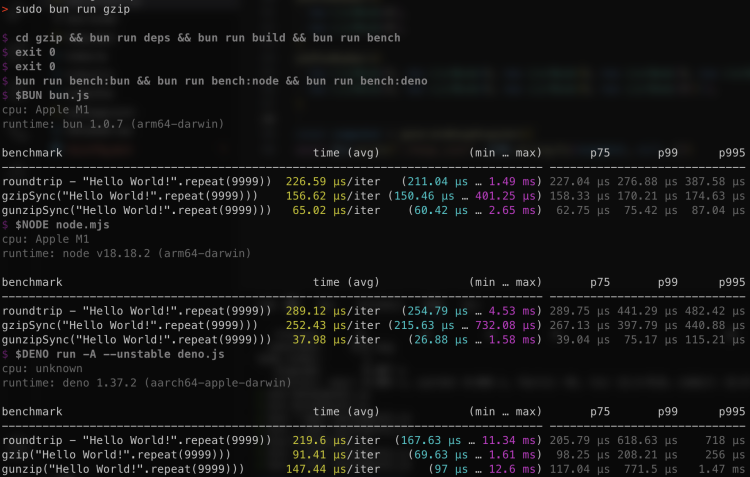
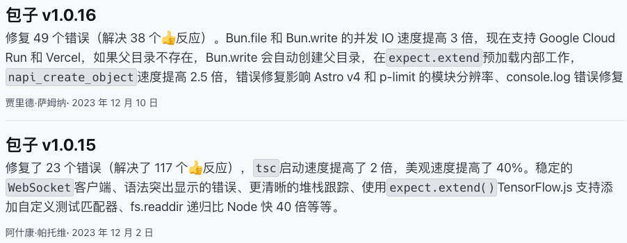
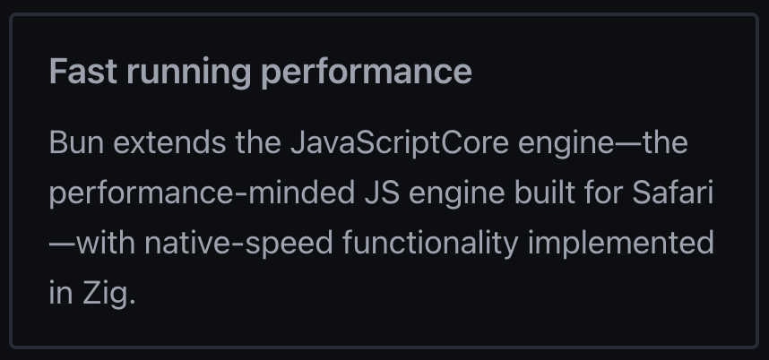

> 前言：Node、Deno、Bun 互属 JS Runtime 领域的竞品，而 Bun 作为今年的后起之秀，本文尝试探讨它的优劣势及发展前景


## 性能

- Bun 的宣传方向就是性能，官网主页的右侧图片区放的就是 Benchmark 结果

- 粗略的看一遍文档，总感觉高性能的原因就是这两个名词 JavaScriptCore、Zig
- JavaScriptCore：Safari 现役 JS 编译器
- Zig：一种低级语言，类比 C、Rust，支持手动内存控制

> 事实真的如此吗？


### JavaScriptCore 并不比 V8 快

- Benchmark
   - [https://programming-language-benchmarks.vercel.app/typescript-vs-javascript](https://programming-language-benchmarks.vercel.app/typescript-vs-javascript)
   - Node : Deno : Bun = 0 : 10 : 8
   - 详细对比
      - 遍历二叉树：Bun > Deno >> Node
      - 素数生成：Deno > Node > Bun
      - helloworld：Bun > Deno > Node
      - http-server：Bun >> Deno >> Node
      - JSON Encode/Decode：Bun > Node > Deno
      - LRU：Deno > Node > Bun
      - Merkle树（一种签名算法）：相差不大
      - nbody（[一个力学问题](https://en.wikipedia.org/wiki/N-body_problem)）：Deno > Node > Bun
      - secp256k1（一种椭圆曲线的签名算法）：Deno > Bun > Node
   - http-server 非常快
   - Bun 的启动速度明显更快

   - 数据结构、字符串处理、哈希算法这些方面总体不如 Deno
   - 结论：JSC 启动比较快，运行并不快，http-server 特别快
- JavaScript 引擎
   - JavaScriptCore、V8、SpiderMonkey 等主流 JS 引擎，采用的架构设计基本相同，一般会由一个解释器和一个优化编译器组成
   - builder.io 这篇文章有一段描述：V8 和 JSC 有不同的架构和优化策略。JSC 优先考虑更快的启动时间和减少内存使用以及稍慢的执行时间。另一方面， **V8 优先考虑快速执行，并进行更多运行时优化** ，这可能会导致更多内存使用
[https://www.builder.io/blog/bun-vs-node-js](https://www.builder.io/blog/bun-vs-node-js)**
   - 结论：JSC 启动快，V8 运行快


### Zig 并不比 Rust 快

-  **Benchmark1** 
   - gzip 是一种计算密集型的任务，没有并发，单纯考验语言单线程性能，因此这里用 bun 官方提供的 gzip benchmark 代码进行测试
   - 三份 gzip 的代码都确认过是调用低级语言编写的 API 实现的
      - Bun 使用内置`Bun.gzipSync()`，基于 Zig 编写
      - Deno 使用 Web 标准的 CompressionStream API，由 Rust 实现
      - Node 使用 zlib 库，由 C 实现
   - 发现 Deno 的总耗时比 Bun 更少

   - 结论：Zig 性能并无优势
-  **Benchmark2** 
   - [https://programming-language-benchmarks.vercel.app/zig-vs-rust](https://programming-language-benchmarks.vercel.app/zig-vs-rust)
   - 详细对比
      - 遍历二叉树：Rust > Zig
      - 数学常数小数位计算 (e、φ等等)：Rust >> Zig
      - fannkuch-redux（数据结构，大量排列操作）：Rust > Zig
      - fasta（随机字符串生成）：Zig > Rust
      - helloworld：Zig > Rust
      - JSON Encode/Decode：Rust > Zig
      - knucleotide（子序列查找问题）：Rust > Zig
      - LRU：Zig > Rust
      - mandelbrot（数学运算）：Rust > Zig
      - Merkle树（一种签名算法）：Rust > Zig
      - nbody（力学问题）：Rust > Zig
      - 素数查找：Zig > Rust
      - π小数位计算：Rust > Zig
      - spectral-norm（矩阵运算）：差距不大
   - Rust 9:4 Zig 胜出，Zig 性能并无优势


> 那为什么 Benchmark 可以那么漂亮？


### 原生 API 快

- 尽量选用性能优先的库
   - `Bun.serve()`依赖 uWebsocket
      - [https://github.com/oven-sh/bun/tree/c08e8a76eff713f87a1f0791bba803c2b110a7a7/packages/bun-uws](https://github.com/oven-sh/bun/tree/c08e8a76eff713f87a1f0791bba803c2b110a7a7/packages/bun-uws)
   - uWebsocket 是一个 C++ 编写，注重性能的 Web Server
      - 
      - 
   - 一个非常有意思的 Benchmark 结果
      - [https://github.com/SaltyAom/bun-http-framework-benchmark](https://github.com/SaltyAom/bun-http-framework-benchmark)
      - 在 Node 下使用 uWebsocket 才是速度最快的选项
      - 说明`Bun.serve()`的速度来源于 uWebsocket，而且在 Bun 下运行速度不如 Node
   - uWebsocket 快到什么程度
      - [https://web-frameworks-benchmark.netlify.app/result](https://web-frameworks-benchmark.netlify.app/result)
      - 在这份全语言的 Web Frameworks Benchmark 中，uWebsocket 排在第三，仅次于 Nim 编写的两个项目
      - 与第二差距不大，第一名 happyx 今年 5 月发布 1.0 版本，uWebsocket 则有 7 年的历史
   - 综合稳定和性能的考虑，uWebsocket 确实是最优选
- 尽量用低级语言去实现 API
   - Bun Repo
      - [https://github.com/oven-sh/bun/tree/c08e8a76eff713f87a1f0791bba803c2b110a7a7/src](https://github.com/oven-sh/bun/tree/c08e8a76eff713f87a1f0791bba803c2b110a7a7/src)
      - 包括`Bun.build()`、`bun test`、`Bun.file()`等高性能 API，都是使用 Zig 实现的
      - 本质与 ESBuild、Turbopack 类似，通过将性能敏感的模块用低级语言替代，提升模块执行速度
   - Bun 有将近 90% 的代码来自低级语言，Node 的 JS 占比则高达 62%


> Bun API 很快，我想用于生产


## 迁移到 Bun API

### 钱包 Server 改造

- Bun.serve() 与 uWebsocket 不适合用于改造
   - 这两个都属于比较底层的 Server API，类似 Node 的 http 模块，没有中间件机制，原有 express 用到的中间件迁移过来成本较高，很多部分都要自己重写
- hyper-express 是一个基于 uWebsocket.js 封装的，仿 express API 的 Server，它的性能表现也非常不错
   - [https://web-frameworks-benchmark.netlify.app/result?l=javascript](https://web-frameworks-benchmark.netlify.app/result?l=javascript)
   - 对于只返回一个空 div 的页面，hyper-express 和 express 的性能表现如下
吞吐量 7454:4722， **hyper-express 提升效果约 58%** 


   - 对于一个有接口请求的页面，hyper-express 和 express 的性能表现如下
吞吐量 146:66，**hyper-express 提升效果约 120%
 **注：没有模拟用户权限，这里的效果是请求得到 1008 触发重定向的返回结果，若完成请求执行 render，时间会更长些** **
- hyper-express 踩坑记录
   - 静态资源服务
      - hyper-express 没有内置的 express.static() 中间件，官方提供的方案是 live-directory 这个库
      - live-directory 主要就是提供了一个文件加载器，在内存加了一层文件缓存，路由还是由 hyper-express 提供的
   - hyper-express 给的 live-directory demo 加载不到文件
      - 调试 live-directory 源码发现它读取的 extension 是不带`.`的，但是 demo 上带了`.`
      - 去掉 extensions 配置中扩展名的`.`解决
      - hyper-express 还有其他问题，后续直接用 live-directory 最新 demo
      - [https://github.com/kartikk221/hyper-express/blob/master/docs/LiveDirectory.md](https://github.com/kartikk221/hyper-express/blob/master/docs/LiveDirectory.md)
      - [https://github.com/kartikk221/live-directory/blob/main/docs/Examples.md](https://github.com/kartikk221/live-directory/blob/main/docs/Examples.md)
   - hyper-express 中 headersSent 始终返回 false，导致 qwik-city 的 notFound 判断失效，所有路由都返回了 404
      - 去掉 notFound 中间件，404 改在静态资源路由中处理
   - 没有 socket 对象，qwik-city 部分源码取了 socket 中的内容且没有用`?`进行防御
      - 通过 patch 给源码加上`?`解决，另外项目源码也有部分用到 socket，也需要加上`?`
- 目前结果：首页可以正常加载，但加载异步模块的时候会报变量重复声明的错误


### bun test

- 在 pci-sdk 的单测中尝试使用 Bun
- 如果想切换到`bun test`，需要处理以下几步
   - 每个 .test 文件都需要增加`import { expect, test } from "bun:test"`的引入，以替换 jest 全局注入的方法
   - DOM 测试库，文档宣称适配的只有这三个

   - `bun test`的配置是在 bunfig.toml 中的，仅支持 jest 部分配置
```toml
[test]
coverage = true
```

- 如果只是用	Bun 运行 Jest 呢？ 
   - 直接运行`bun run --bun jest`，会报一个 jsdom 的错误，社区上找不到相关资料，源码看不出原因

   - happy-dom 提供了 Jest 适配，主要依赖 @happy-dom/jest-environment 这个库，安装以后再执行一遍命令，报一个 jest-runtime 的错误，社区上找不到相关资料

   - 社区资料也没有明确指向，遂放弃

> 总的来说，现有项目，即使是比较小型的，也难以迁移到 Bun


## Bun Roadmap
[https://github.com/oven-sh/bun/issues/159](https://github.com/oven-sh/bun/issues/159)

-  **Bundler** 
   - 只支持输出 ESM，未支持 CJS、IIFE
   - 未支持 HMR
   - 未支持 CSS Parser，所以还不支持 CSS 压缩等相关功能
   - 插件功能较少（JS AST API）
   - 补充：Bundler 产物优化程度不足
[https://feday.fequan.com/2023/Vue%20%26%20Vite%20Update%40FEDAY2023_evan.pdf](https://feday.fequan.com/2023/Vue%20%26%20Vite%20Update%40FEDAY2023_evan.pdf)
-  **网络** 
   - fetch 和 server 均不支持 h2/h3
   - fetch 不支持 TLS1.3 的 0-RTT
-  **Node API** 
   - 未支持 Cluster
   - 没有 V8 相关 API
   - TextEncoderStream 未实现导致 Qwik 无法启动，官方提供中间件添加 polyfill 解决
   - 一些性能优化 TODO
-  **文档没写到的** 
   - Windows 支持不好，可用 WSL 替代，团队有在做 Windows 适配
   - 缺少第一方的开发服务器、本地代理、热更新方案
   - 缺少 patch 方案
-  **结论** 
   - Bundler：不太完善，需要与 Node 模块混用，兼容能力有待考证，产物优化程度不够
   - 网络：h2 不支持是比较大的问题
   - Node API：支持度还不错，缺失的部分没有那么重要
   - 文档没写到的：需要找替代（Node 库）
   - Bug
      - Bun

      - Deno

      - Node

      - 看了一遍，主要都是一些 API 调用的问题
      - 对比下来，体现出其 API 距离生产环境还有比较远的距离


## DX 是 Bun 的亮点
> DX = Developer Experience，即开发者体验
> reddit 这个帖子里，有多人提到了这个观点
> [https://www.reddit.com/r/node/comments/16e19xi/why_bun_is_so_much_faster_then_node/](https://www.reddit.com/r/node/comments/16e19xi/why_bun_is_so_much_faster_then_node/)


### ESM 与 CJS 的兼容

- 支持 ESM 与 CJS 模块相互引用
   - Deno：只支持受限的相互导入
   - Node：只支持受限的相互导入
   - Bun：支持在同一个文件中使用 import 和 require，更自由的模块混合方式
      - [https://news.ycombinator.com/item?id=37437848](https://news.ycombinator.com/item?id=37437848)
      - 作者说明了 Bun 模块混用的原理
- 更多 Bun 模块解析的规则和实现细节参考官方文档
   - [https://bun.sh/docs/runtime/modules](https://bun.sh/docs/runtime/modules)


### 一站式解决方案

- 编译器
   - ts、tsx 的原生支持
   - 暴露 Transpiler 模块，提供 ts、tsx 转译能力
   - 内置 toml 文件解析
- 包管理器
   - install、remove、update、link 等基础功能
   - 内置 workspaces
   - 二进制的 Lockfile（提速）
   - bunx
- 命令行工具
   - `bun create`：根据模板创建项目，支持 @bun-examples 内多种预设模板，也可使用 github 仓库、本地目录作为模板源
   - `bun test`：仿 Jest API 的测试框架
   - `bunx serve <dir>`：类似 http-server，起一个静态资源服务器
- JS 函数
   - `Bun.serve()`：Server，内置 WebSocket
      - 由于不支持中间件，所以拓展一些高级功能比较困难，比如我想提供一个静态资源服务，只能找 Node 生态的第三方库解决，比如 serve-static
      - 由此看来，`Bun.serve()`定位更接近 Node 的 http 模块，是一个底层的 http/ws 服务器，而不是一个服务端框架
   - `Bun.build()`：打包器，还有一套命令行工具`bun build`
      - 支持 entry、outdir、minify、sourcemap、splitting 等基础功能
      - 支持一组内置的 loader，可以开箱即用的加载图片、wasm、toml 等文件类型
      - 类似 esbuild 的插件系统，更专注于编译期间的处理，而不是构建全流程
   - `Bun.file()`：类似 fs-extra，是一套 API 比较简洁的文件管理工具
      - [https://bun.sh/docs/api/file-io](https://bun.sh/docs/api/file-io)
      - 内置 MIME type 解析
   - `Hashing`：一组内置的高性能 hash 函数
      - `Bun.password`
      - `Bun.hash`
      - `Bun.CryptoHasher`
   - `Bun.gzipSync()`、`Bun.deflateSync`：内置压缩算法实现，基于 Zig

> all-in-one 为什么很重要？


### 与 Node 生态的高度兼容

- 官方文档明确说明了它正致力于针对现有框架，提供更好的 Node 兼容性和集成
   - [https://bun.sh/docs](https://bun.sh/docs)
- `bun run --bun`支持 vite/jest 等命令在 Bun 下运行
   - [https://bun.sh/docs/cli/run#bun](https://bun.sh/docs/cli/run#bun)
   - `--bun`标识可以修改命令脚本中的 shebang 标识，从而强制使用 Bun 执行里面的 JS 代码
- Node API
   - [https://bun.sh/docs/runtime/nodejs-apis](https://bun.sh/docs/runtime/nodejs-apis)
   - Bun 已实现大部分关键的 Node API
- 与 Node 完全兼容的模块解析规则
   - [https://bun.sh/docs/runtime/modules#importing-packages](https://bun.sh/docs/runtime/modules#importing-packages)
- 尽量兼容 npm/yarn/pnpm 等功能的 bunfig.toml
   - 类似 .npmrc，但涵盖的东西更多，它还要支持一些内置 API 如 test、install 的配置
   - 不支持 .npmrc，比如 registry 需要改变语法配到 bunfig.toml 中
```bash
# .npmrc
registry=http://registry.npmmirror.com
@payment:registry=https://payment-fe-npm.duowan.com
@yy:registry=https://npm-registry.duowan.com
@sl:registry=https://npm-registry.duowan.com

# bunfig.toml
[install]
registry = "http://registry.npmmirror.com"
[install.scopes]
payment = "https://payment-fe-npm.duowan.com"
yy = "https://npm-registry.duowan.com"
sl = "https://npm-registry.duowan.com"
```


### What about Deno?

-  **Deno 简介** 
   - [https://docs.deno.com/](https://docs.deno.com/)
   - Deno 是一个 Rust 开发的 JS 运行时
   - 强调拥抱 Web 标准，不少 API 都用 Web 标准替代，比如 Node 生态的 zlib，在 Deno 中被 Compression Streams API 替代
      - [https://developer.mozilla.org/en-US/docs/Web/API/Compression_Streams_API](https://developer.mozilla.org/en-US/docs/Web/API/Compression_Streams_API)
-  **根据 Ryan 在 JSConf 的分享，Deno 早期就是奔着与 Node 生态割裂而去的** 
   - 针对 Node 的安全性问题，加强了原生 API 访问文件系统与网络的限制（与 Node 不兼容的权限系统）
      - [https://docs.deno.com/runtime/manual/basics/permissions](https://docs.deno.com/runtime/manual/basics/permissions)
   - 舍弃了 package.json
   - 不支持 npm，自建第三方包管理方案
   - 开发了一系列仅适配 Deno 生态的开箱即用工具
      - linter、formatter、test-runner、bundler、oak、fresh
   - 它和 Bun 有什么区别？
   -  **我认为它们最大的区别就是对 Node 的态度** 
-  **2022年6月，Deno 获得由红杉领投的 2100w 美元的 A 轮融资，用于发展 Deno Deploy** 
   - 出于商业考虑，Deno 必须扩大自己的用户基础，而最大的潜在用户，就是 Node 开发者
   - 因此 Deno 在 2022 年做了大量针对 Node 的适配，包括支持 npm 包导入、兼容 Node API 等等
- References
   - 2年过去了，谁还记得曾想取代Node.js的他？ [https://mp.weixin.qq.com/s/DcZ7JkL759ENKvgosrpsOQ](https://mp.weixin.qq.com/s/DcZ7JkL759ENKvgosrpsOQ)
   - Node.js 十大设计缺陷 - Ryan Dahl - JSConf EU [https://www.youtube.com/watch?v=M3BM9TB-8yA](https://www.youtube.com/watch?v=M3BM9TB-8yA)


## 总结

### 优势

- Bun 内置 API 速度很快（from Zig&C）
- 命令行启动速度很快（from JSC）
- 作为一个 all-in-one toolkit，常规场景都可以使用内置 API，带来的是更低的学习成本、更少的依赖选型、更快速的使用

### 劣势

- 出现时间晚，Bug、与 Node 生态的兼容问题比较多，现有项目难以平滑迁移到 Bun
   - Node：2009年5月
   - Deno：2020年5月
   - Bun：2023年9月
- JS 执行速度本身不快，运行纯 JS，以及 Node 库速度并无优势
- 因此要说服旧项目迁移到 Bun 还有距离

### 使用场景

-  **命令行小工具** ：借助其启动快的优势，比较适合用来写一些高性能的命令行工具
-  **新且小的项目** 
   - 新项目没有历史包袱，无需考虑迁移的复杂度
   - 功能较简单的话，可以优先考虑 Bun API
   - 选用 Node 库的话，新项目也可以逐步验证兼容问题，避免指数级上升的复杂度
-  **FaaS** ：all-in-one + 高性能非常适合云函数场景
   - 云函数多为从零开始的代码，没有历史代码，较少第三方依赖，因此容易适应新的环境，享受其高性能优势
   - all-in-one 也有助于减少第三方依赖
   - Bun 和 Deno 的文档都多次提到边缘计算/云函数/Serverless，这是目前市场比较认同的一种商业模式，Deno 的融资就是靠 Deno Deploy 的 Serverless 服务

### 未来展望

- Bun 近期更新
   - 最近几个版本除了修复 bug 之外，作者团队仍专注于提升 Bun API 的性能

   - http2 支持，从而支持 gRPC

- 假如基于 Bun API 的第三方依赖足够多足够成熟，它可以彻底成为 Node 的高性能替代品，但演化可能性存疑
   - 开发量大
   - 开源不那么赚钱
   - 互联网大爆发的时代已经过去，社区创造力下降


## 补充

### 文档的错觉

- 下图将 Bun starts fast and runs fast. It extends JavaScriptCore 这两句话放在一起，给人一种 because 的错觉，而实际上两句话并无关联

- 文档经常强调 JSC 是一个性能考虑的 JS 引擎，但 Bun 的速度来源根本不是这里
同样的还有 Zig，这里的重点本该是 native-speed functionality implemented，但硬掺了一个 Zig 进去，总让人认为功劳是它的，但其实 Rust 也能实现相同的效果



### 了解 Zig

- [https://ziglang.org/learn/overview/](https://ziglang.org/learn/overview/)
- 发布于 2016 年，比 Rust 晚 10 年
- 为什么快速流行？
   - Zig 使用 C ABI (应用程序二进制接口)，也就是说 Zig 与 C、C++ 的编译产物可以相互引用
   - Zig 本身也实现了 C 的交叉编译，甚至支持在 Zig 代码中写 C
   - 文档有一句话：Zig 比 C 更擅长使用 C 库
   - 猜测：兼容 C，并提供更好的工程体验
- 性能/内存
   - [https://programming-language-benchmarks.vercel.app/zig-vs-c](https://programming-language-benchmarks.vercel.app/zig-vs-c)
   - 从 Benchmark 看，速度表现比 C 稍强，内存表现 Zig 优势更大


### uWebSockets 背景知识

-  **uWebSockets 属于 NodeJS 生态** 
   - uWebSockets v0.1 诞生于7年前，它的 NodeJS binding，uWebSockets.js 诞生于5年前
[https://github.com/uNetworking/uWebSockets.js/tree/v0.0.1](https://github.com/uNetworking/uWebSockets.js/tree/v0.0.1)
   - uWebSockets.js 在诞生之初就已经和 SocketCluster 合作，作为其默认集成的 Server
在这个帖子下面也有人反馈 socket.io 在5年前已经可以集成 uWebSockets，虽然官方并没有宣布支持
[https://news.ycombinator.com/item?id=11736938](https://news.ycombinator.com/item?id=11736938)
   - 作者成立了一个公司 [uNetworking AB](https://github.com/uNetworking) 来接收 uWebSockets 的企业支持和咨询业务，官方宣称库已经支持了众多加密货币交易服务，官方的赞助名单也以加密货币企业为主
[https://github.com/uNetworking/uWebSockets?tab=readme-ov-file#briefcase-commercially-supported](https://github.com/uNetworking/uWebSockets?tab=readme-ov-file#briefcase-commercially-supported)
   - 早期 uWS 使用与 Node 相同的 libuv 实现事件循环，这使得它与 Node 的集成更加丝滑。现在事件循环框架已经是一个可选项，ASIO 似乎是更受认可的高性能选项
[https://github.com/uNetworking/uWebSockets?tab=readme-ov-file#wrench-customizable-architecture](https://github.com/uNetworking/uWebSockets?tab=readme-ov-file#wrench-customizable-architecture)
-  **为什么性能这么好的 Web Framework 一直很少人用？** 
   - 作者早期对社区的态度比较恶劣，很多人由于作者的态度选择远离这个项目
      - 16年 uWebSockets 推广的时候，在 HackerNews 和 Reddit 跟网友对喷，无视社区提出的问题
      - 在 Deno 推出 http 服务器的时候，在 Github 开了一个攻击其性能表现的 Issue，最终被 Deno 封禁
      - 在 ws 下提 Issue 要求其文档将 "fastest" 改为 "fast"
      - 在 uWebSockets 仓库中删除大量质疑其性能来源的 Issue 和 PR
      - 作者在 npm 上发布了一个 18.x 最新版本，而内容是一个空包
   - 参考链接
      - [https://www.reddit.com/r/javascript/comments/4oyp2u/uwebsockets_blazing_fast_websocket_implementation/](https://www.reddit.com/r/javascript/comments/4oyp2u/uwebsockets_blazing_fast_websocket_implementation/)
      - [https://www.reddit.com/r/node/comments/91kgte/uws_has_been_deprecated/](https://www.reddit.com/r/node/comments/91kgte/uws_has_been_deprecated/)
      - [https://news.ycombinator.com/item?id=11736938](https://news.ycombinator.com/item?id=11736938)
      - [https://github.com/denoland/deno/issues/1205](https://github.com/denoland/deno/issues/1205)
      - [https://github.com/websockets/ws/issues/757](https://github.com/websockets/ws/issues/757)
-  **现状：旧项目难以将 Web Server 迁移到 uWebSockets.js** 
   - 基于 uWebSockets 封装的高性能 express like 框架都比较年轻，包括 [hyper-express](https://github.com/kartikk221/hyper-express)、[routejs-uwebsocket](https://routejs.github.io/docs)、[fiber](https://ionited.io/) 等，最长的也只有 hyper-express 的2年
[https://web-frameworks-benchmark.netlify.app/result?l=javascript](https://web-frameworks-benchmark.netlify.app/result?l=javascript)
   - [Sifrr](https://github.com/sifrr/sifrr/tree/master/packages/server/sifrr-server) 有5年的历史，但它最后一次维护已经是3年前
   - 坑也比较多，尝试过现有 express 项目较难直接迁移到这些项目上
   - 如果有比较轻量的项目，Node + uWebSockets 是可选项
- ` **Bun.serve()** ` **可以期待** 
   - 它是一个 uWS.js 的二次封装
   - Bun 与 uWebSockets 团队保持着良好的关系
   - 它的 Benchmark 表现略逊于 uWebSockets，原因是 Bun.serve() 需要在 uWS.js 基础上包装一层 Web API，例如 Request、Response
[https://github.com/uNetworking/uWebSockets/discussions/1466](https://github.com/uNetworking/uWebSockets/discussions/1466)
   - 与 Bun API 集成更能发挥它的优势
