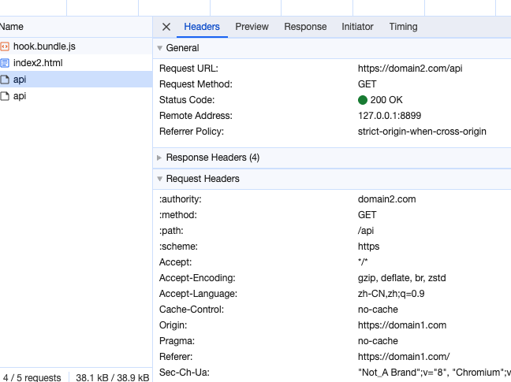

### 简介

### 时间表

- [https://privacysandbox.com/intl/zh_cn/open-web/#the-privacy-sandbox-timeline](https://privacysandbox.com/intl/zh_cn/open-web/#the-privacy-sandbox-timeline)

- [https://developer.chrome.com/en/docs/privacy-sandbox/third-party-cookie-phase-out/](https://developer.chrome.com/en/docs/privacy-sandbox/third-party-cookie-phase-out/)

- [https://techcrunch.com/2023/05/18/google-will-disable-third-party-cookies-for-1-of-chrome-users-in-q1-2024/](https://techcrunch.com/2023/05/18/google-will-disable-third-party-cookies-for-1-of-chrome-users-in-q1-2024/)

[https://en.wikipedia.org/wiki/TechCrunch](https://en.wikipedia.org/wiki/TechCrunch)
- 具体时间不好说，因为 google 最早宣布要淘汰是 22 年，两次官宣延期，目前看至少 24 年的 canary 版本才会有动作

### 现有业务影响演示
开关：chrome://flags/#test-third-party-cookie-phaseout

### 解决方案
[https://developer.chrome.com/en/docs/privacy-sandbox/third-party-cookie-phase-out/#partitioned](https://developer.chrome.com/en/docs/privacy-sandbox/third-party-cookie-phase-out/#partitioned)

### CHIPS

#### Test Third Party Cookie Phaseout = Disabled

#### Test Third Party Cookie Phaseout = Enabled

#### Partitioned

### 其他 API

[https://privacysandbox.com/intl/zh_cn/open-web/#the-privacy-sandbox-timeline](https://privacysandbox.com/intl/zh_cn/open-web/#the-privacy-sandbox-timeline)

### References
Web 隐私沙盒：[https://privacysandbox.com/intl/zh_cn/open-web/](https://privacysandbox.com/intl/zh_cn/open-web/)
第三方 cookie 淘汰计划：[https://developer.chrome.com/en/docs/privacy-sandbox/third-party-cookie-phase-out/](https://developer.chrome.com/en/docs/privacy-sandbox/third-party-cookie-phase-out/)
2024 Q1 1% 灰度：[https://techcrunch.com/2023/05/18/google-will-disable-third-party-cookies-for-1-of-chrome-users-in-q1-2024/](https://techcrunch.com/2023/05/18/google-will-disable-third-party-cookies-for-1-of-chrome-users-in-q1-2024/)
CHIPS mdn：[https://developer.mozilla.org/en-US/docs/Web/Privacy/Partitioned_cookies](https://developer.mozilla.org/en-US/docs/Web/Privacy/Partitioned_cookies)
CHIPS google developer：[https://developer.chrome.com/docs/privacy-sandbox/chips/](https://developer.chrome.com/docs/privacy-sandbox/chips/)
<fencedframe>：[https://developer.chrome.com/docs/privacy-sandbox/fenced-frame/](https://developer.chrome.com/docs/privacy-sandbox/fenced-frame/)

