# html-webpack-plugin 4.x 对多模板下热重载缓慢问题的修复

### 前言

手上的公司项目热重载一直很慢，每次热重载大概要 `15s` 左右，最近实在忍无可忍，决定排查一下。

### 猜想

项目是基于 vue-cli2 搭建的，前人将 webpack 升级到了 webpack4。出于历史原因，公司项目的模块是根据模板（.html）划分的，因此项目中存在`超过 30 个模板`。这让我想起了之前在优化一个 webpack3 项目的时候，也遇到过类似的多模板热重载缓慢的情况，当时是使用 html-webpack-plugin-for-multihtml 库 [解决了问题](/build/webpack-1-project-optimization.html#%E4%BD%BF%E7%94%A8html-webpack-plugin-for-multihtml%E6%8F%90%E5%8D%87%E5%A4%9A%E5%85%A5%E5%8F%A3%E9%A1%B9%E7%9B%AE%E9%87%8D%E5%BB%BA%E9%80%9F%E5%BA%A6)，因此我想，这次会不会也是 html-webpack-plugin 的锅呢？

### 升级 html-webpack-plugin 问题解决

我尝试把 html-webpack-plugin 升级到了最新的 [@4.0.0-beta.8 ](/4.0.0-beta.8 ) 版本，发现热重载速度 `降到了 1s` 左右！

问题解决了，可是其中的原理是什么呢？

### 使用 cpuprofile-webpack-plugin 进行性能分析

[cpuprofile-webpack-plugin](npmjs.com/package/cpuprofile-webpack-plugin) 是一个图形化的 webpack 构建性能分析工具，它会统计构建过程中每个插件运行的时间，还会生成整个构建过程的[火焰图](https://github.com/brendangregg/FlameGraph)，如下图，它记录了我的项目使用 html-webpack-plugin[@3.2.0 ](/3.2.0 ) 时一次热重载的性能分析： 

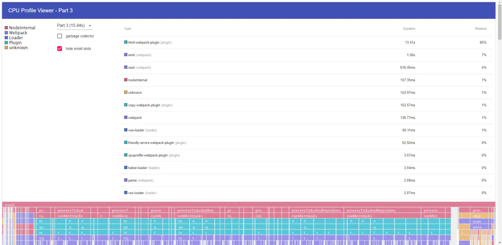
> 图：cpuprofile-webpack-plugin 分析结果

我们发现在整个 15.94s 的热重载过程中，html-webpack-plugin 的运行时间占据了 `13.51s`，可以说几乎全部时间都用在了这上面，这个图也验证了我的猜想。接下来，我们通过火焰图进一步分析，首先找一个运行时间较长，比较有代表性的 html-webpack-plugin 执行过程：

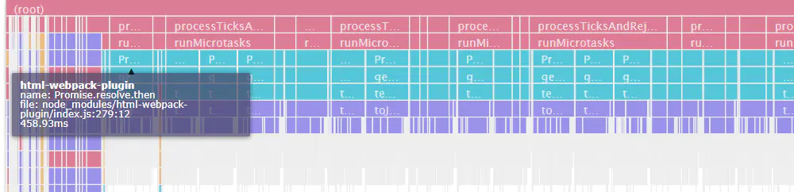
> 图：一次时间较长的 html-webpack-plugin 运行

点击进去，查看更详细的调用栈分析：

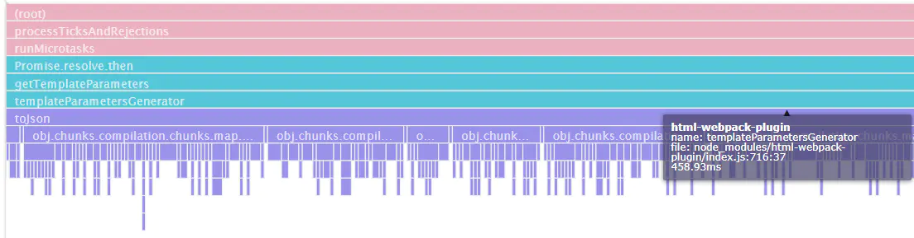
> 图：html-webpack-plugin 详细的调用栈分析

发现全部耗时集中在 html-webpack-plugin/index.js -> templateParametersGenerator -> toJson 函数上。

### 查看源码

首先查看了最新版（4.0.0-beta.8）中 templateParametersGenerator 方法的源码，可以看出它是用来生成 templateParameters 的默认配置的，而在这个版本中它并`没有调用 toJson 方法`：

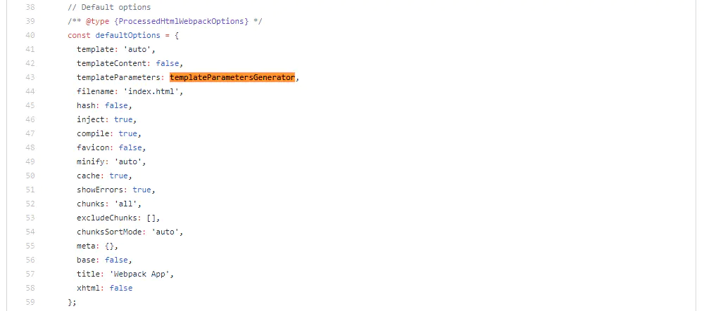
> 图：4.0.0-beta.8 templateParametersGenerator 的调用

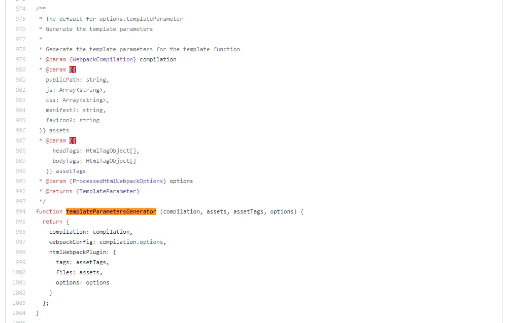
> 图：4.0.0-beta.8 templateParametersGenerator 的定义

然后回溯 3.2.0 版本之前的提交，终于见到了它的调用，webpack 文档中解释 compilation.getStats().toJson() 是用来生成编译过程的性能分析 json 文件的方法，那么罪魁祸首就是它了。

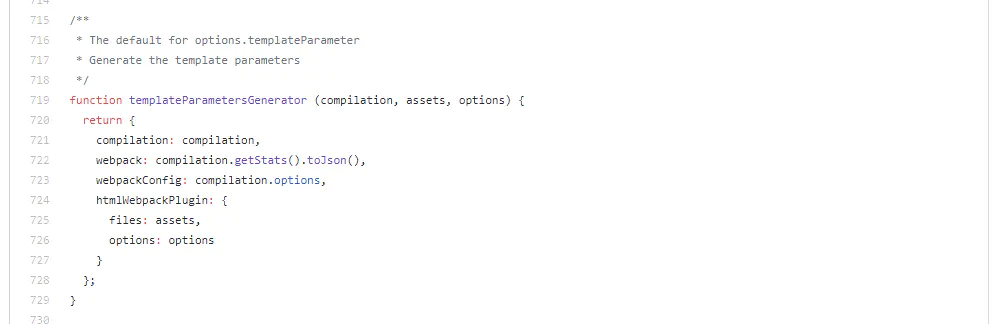
> 图：3.2.0 templateParametersGenerator 的定义

### 查找修复这个问题的 commit

后来我尝试了把 html-webpack-plugin 的版本回退到 4.x 的第一个版本 4.0.0-alpha，发现热重载性能依然是没问题的，因此提交的定位就在 3.2.0 到 4.0.0-alpha 之间，经过一番查找，终于找到了这个 fix，`出于性能原因移除 compilation.getStats()`：

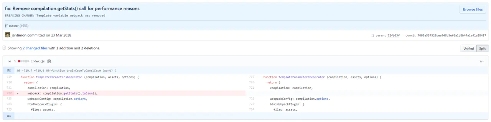
> 图：fix: Remove compilation.getStats() call for performance reasons

### 后记

其实这次排查我也走了不少弯路，之前一直在尝试通过阅读代码查找，找了一天都找不出来，后来使用了性能分析工具才知道自己之前有多蠢 :-)。本文只是给大家讲一个性能分析的故事，为大家提供一些思路，希望大家的代码都没有bug~

### 附：html-webpack-plugin 4.x 钩子函数的变更

由于我的代码里踩了这个坑，所以给大家讲一下，html-webpack-plugin 4.x 对钩子函数进行了`重构`，注意是重构，不是更新，也就是说，虽然名字改了，但是所有功能都是没有变化且一一对应的，作者的 commit 里使用的 badge 也是 `refactor`：

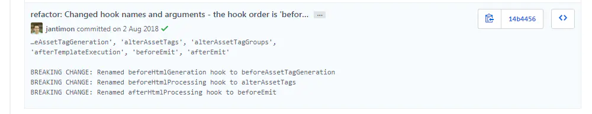
> 图：钩子函数重构的 commit

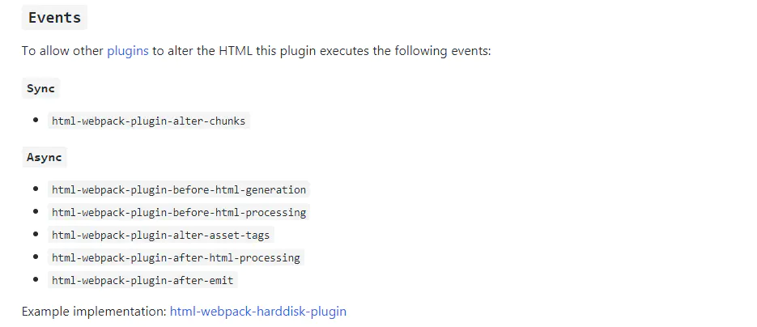
> 图：3.x 钩子函数文档

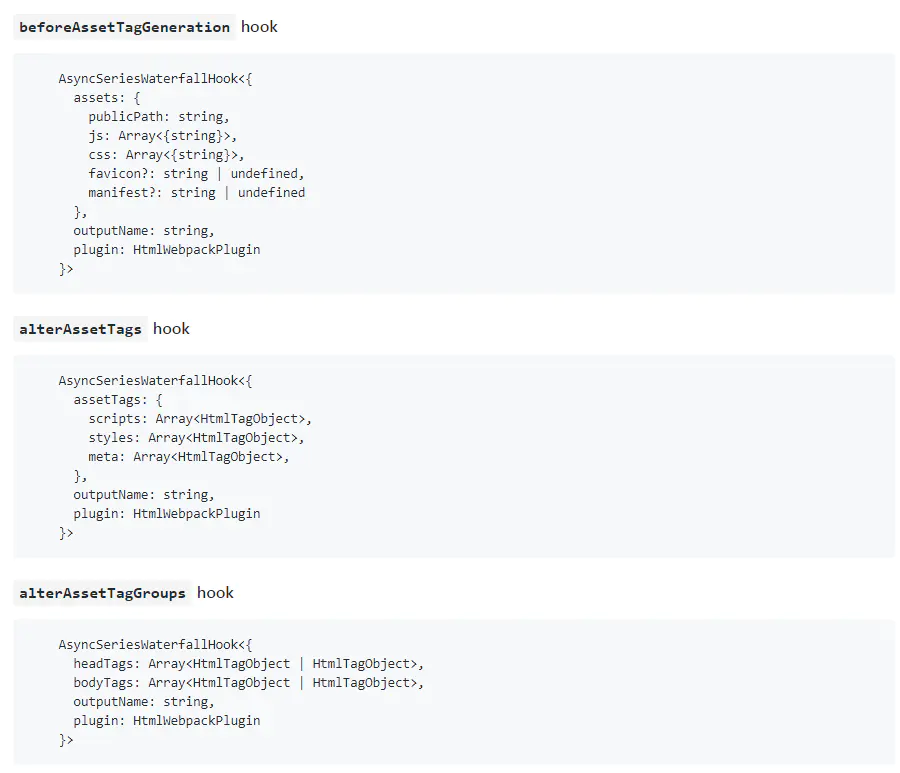
> 图：4.x 钩子函数文档

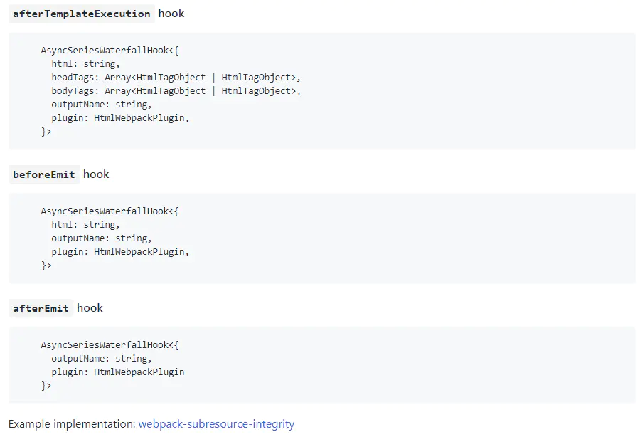
> 图：4.x 钩子函数文档

