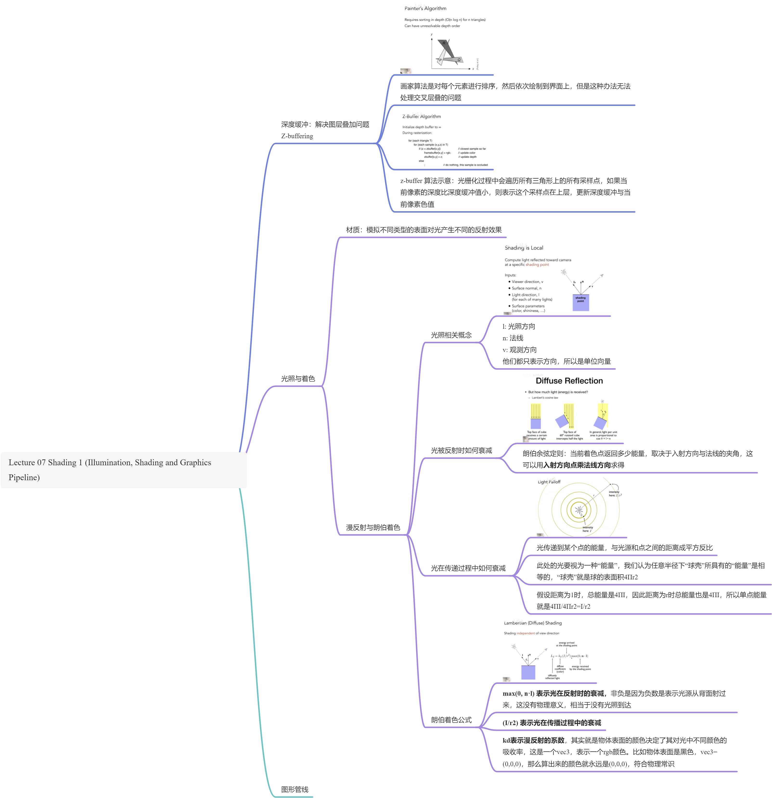

# GAMES101 - 05 to xx

### Lecture 05 Rasterization 1 (Triangles)

#### 透视投影（Perspective Projection）

1. 如何定义近平面？
- 通常人们会通过 vertical field-of-view (fovY，一般翻译为垂直可视角度) 和 aspect ratio (纵横比) 来定义；
- 可以发现只要通过垂直可视角度+纵横比，就可以完整推断出一个近平面；

2. 如何将 fovY 和 aspect 转化为近平面的定义 l、r、b、t？
- 看下面这个侧视图，可见 fovY 和 aspect 的两个关系式；

- 所以这里就只讲了它是可以互相推导转化的是吧。。没有给出最终总结的公式，先往下看吧；

#### 将 MVP 后得到的立方体绘制到屏幕上

1. 什么是 screen？
- 是一个二维数组，其中每一个元素都是一个像素；
- 数组的大小：分辨率（resolution）；
- 是一种典型的光栅化成像设备（raster display）；
2. 名词解析
- Raster 在德语中就是屏幕（screen）的意思；
- Rasterize 就是指在屏幕上绘制（drawing onto the screen）；
- Pixel 是 picture element 的简写；
- 像素暂时可以理解为显示的最小单位，每个像素只由一种颜色填充而成；
3. 定义屏幕空间
- 有一些约定俗成的规则；
- 通常用 (x, y) 来表示某个像素；
- 所有像素，通常表示为 (0, 0) to (width - 1, height - 1)；
- 某个像素点 (x, y) 的中心是 (x + 0.5, y + 0.5)；
- 像素覆盖的区域是 (0, 0) to (width, height)；
4.  **此时我们要做的就是将立方体 [-1, 1]2 绘制到 [0, width] × [0, height] 的屏幕上；** 
- 这里涉及的变换就是先将 [-1, 1]2 缩放成 [width, height] 的大小；
- 再将中心点 [0, 0] 平移到 [width/2, height/2]；
- ；

#### 成像设备

1.  **示波器** 
- 成像原理就是左图的 **阴极射线管（Cathode Ray Tube，简称 CRT）** ；
- 左边是一个电子发射器，经过聚焦、加速偏转系统的处理，让电子束打在荧光屏上不同的位置；
- 右图说的是隔行扫描技术（Raster Scan Pattern of Interlaced Display，直译好像叫隔行显示的光栅扫描模式）；
- 指的是利用人眼的视觉暂留特性，交错显示奇数行与偶数行，降低消耗；
- 隔行扫描对高速运动非常不友好，容易产生撕裂现象；
- 这些都是早期技术，现在已经基本不用了，今天常用的 LCD、OLED 设备通常称为 **平板显示器（Flat Panel Displays）** ；

2.  **液晶显示器（Liquid Crystal Display，简称 LCD）** 
- 液晶可以扭曲光束；
- 有左右两个光栅，光从右边进来是竖直方向的，经过中间的液晶，就可以变成水平方向的光栅；
- 感觉这块可以专门找个科普 lcd 显示器的文章看看；

3.  **发光二极管阵列（Light emitting diode array，简称 LED）** 
- 很好理解，就是一个 n×n 的二极管阵列，通过每个二极管发出不同的光来模拟像素阵列；
- 但是感觉这种类似灯泡的东西，相邻的显色是不是会互相影响导致显色效果不好？
4.  **墨水屏（Electronic Ink Display）** 
- 通过正电子在上还是负电子在上，控制显示黑色还是白色；
- 刷新率很低，电子整体翻转，速度比较慢，表现为翻页的速度很慢；
- 好处就是看起来比较自然；

#### 将三角形绘制到光栅显示设备上

1.  **为什么是三角形？** 
- 三角形是最基础的多边形，任何多边形都可以拆成多个三角形；
- 三角形一定是平面的；
- 三角形内部和外部的定义非常清晰；
- 只要定义了三角形三个顶点的颜色，那么可以通过渐变推测出三角形内部所有像素点的颜色，称为中心插值（barycentric interpolation）；
2.  **如何用像素值表示出一个近似的三角形** 
- 问题来源如下图，绘制三角形一定会出现某些像素值只有一半的情况，那在光栅显示设备上如何处理这些像素呢？

- 通过 **采样** 的方式：把一个函数离散化（discretize）的过程，不理解，先过；
- 这里说的采样，是用像素中心对整个屏幕空间进行采样，简单说就是 **判断每个像素点的中心是否在三角形内部** ；
- 下面是示意代码，就是遍历显示区的像素，如果像素中心在三角形内，就将这个像素设为 1 显示，否则设为 0 不显示；

3.  **定义上面的函数** ` **inside(tri, x, y)** `
- 用到了之前讲到的叉乘特性；
- 判断向量的左右位置：右手螺旋定则，如果  的结果是正的，那 a 肯定在 b 右边，反之亦然。比如给你三个点，组成一个三角形，要求一个点 P 是否在三角形内。那只要求三条边分别与三个点和 P 连线的向量之叉积，就可以判断三条连线是否都在边的左边，从而可以判断 P 是否在三角形内；

4. 边界情况
- 本次课程中不作处理；
- 成熟库中一般有严格规定；

5. 光栅化过程是否需要检查屏幕上所有的像素？
- 不需要，只需要检测三角形的包围盒；
- Axis Around Bounding Box，简称 AABB，环坐标系包围盒？

- 增量三角形遍历；
- 适用于瘦长且是旋转得来的三角形；
- 不同类型的三角形会采用不同方式去扫描；

- 锯齿：采样率不够高，产生信号走样（Aliasing）问题，表现为锯齿（Jaggies）；

### Lecture 06 Rasterization 2 (Antialiasing and Z-Buffering)

### Lecture 07 Shading 1 (Illumination, Shading and 
Graphics Pipeline)

### Lecture 08 Shading 2 (Shading, Pipeline and Texture Mapping)

### Resources

- 视频：[https://www.bilibili.com/video/BV1X7411F744?share_source=copy_web](https://www.bilibili.com/video/BV1X7411F744?share_source=copy_web)
- 资料：[https://sites.cs.ucsb.edu/~lingqi/teaching/games101.html](https://sites.cs.ucsb.edu/~lingqi/teaching/games101.html)

