# GAMES101 - 01 to 04

### Source

- 视频：[https://www.bilibili.com/video/BV1X7411F744?share_source=copy_web](https://www.bilibili.com/video/BV1X7411F744?share_source=copy_web)
- 资料：[https://sites.cs.ucsb.edu/~lingqi/teaching/games101.html](https://sites.cs.ucsb.edu/~lingqi/teaching/games101.html)

### Lecture 01 Overview of Computer Graphics

1. 讲了图形学的应用，比如游戏、电影特效、动画、仿真、VR 等等；
2. 101 主要包括四个部分：
- 光栅化（opengl 和 shader 是怎么运作的）
- 曲线和栅格
- 光线追踪
- 动画 & 模拟
3. 不会讲图形库 api，如 opengl，其实就是原理性的东西；

### Lecture 02 Review of Linear Algebra

#### 图形学包括很多学科的内容

1. 数学：线性代数、微积分、统计学；
2. 物理：力学、光学；
3. 其它：信号处理、数值分析；
4. 一定的审美能力；

#### 向量标准化

1.  是指向量 a 的长度，长度为 1 的向量规定为 **单位向量** ；
2. 单位向量可以表示为：，即单位向量=向量/向量长度；
3. 通常可以用一个单位向量表示方向；
4. 会有一些向量的计算，比如求两个向量的和，也就是把两个向量的头尾坐标相加，即可获得结果向量；

#### 向量加法
一般表示为 A=4x+3y 这样的形式，因为这样 **容易计算向量的长度** （勾股定理），貌似这个很重要；

#### 向量乘法-点乘（Vector Multiplication - Dot Product）：

1. 一般表示为；
2. 右边是向量长度和夹角的数字乘法，因此可以将等式转换成这样 ，可以发现点乘非常大的价值就是求向量夹角余弦值；
3. 假如已知的向量是单位向量（长度为 1），那求夹角就更简单了 ；
4. 点乘满足 **交换律、结合律、分配律** ；
5.  **计算方法** ：；
6. 应用上，除了刚才提到的计算 **两个向量的夹角** ，还有就是可以计算一个向量到另一个向量的 **投影向量长度** ；
7. 含义上，点乘可以测量两个两个向量有多么接近、分解向量、还可以判断某两个向量的方向关系（相同、相反、垂直）；

#### 向量乘法-叉乘（Vector Multiplication - Cross Product）：
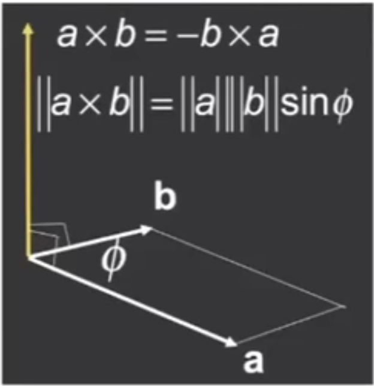

1. 意味着求 a 和 b 所在平面的一个法向量，法向量的方向满足右手螺旋定则，即用右手四指表示从 a 旋转到 b 的方向，然后拇指所指方向就是这个法向量的方向；
2. 公式：
-  **交换律**  ：根据右手旋转坐标系，从 a 旋转到 b 和从 b 旋转到 a 获得的法向量是相反的，可得叉乘不满足交换律，要交换必须给其中一个向量加一个负号（可以根据 x 和 y 轴算出 z 轴，从而建立一个直角坐标系）；
-  **结果向量长度 ** ：向量叉乘结果向量的长度，等于两个向量长度相乘再乘上两个向量夹角的正弦；
-  **同方向单位向量的叉积**  ：同方向的向量叉乘会得到一个 0 向量；
-  **结合律、分配律** ：除了交换律需要加个负号之外，结合律、分配律都是满足的；

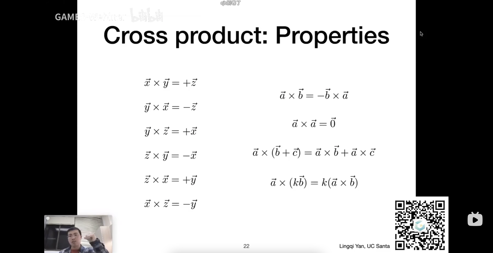

-  **矩阵形式** ：叉积可以表现成矩阵形式 ，这个三阶矩阵视频里叫做 dual matrix of vector a，翻译好像叫 a 的对偶矩阵？不知道是啥意思，然后这个矩阵乘出来的向量就是 ；
3. 作用：
- 判断向量的左右位置：右手螺旋定则，如果  的结果是正的，那 a 肯定在 b 右边，反之亦然。比如给你三个点，组成一个三角形，要求一个点 P 是否在三角形内。那只要求三条边分别与三个点和 P 连线的向量之叉积，就可以判断三条连线是否都在边的左边，从而可以判断 P 是否在三角形内；
- 判断法向量的内外；
- ：给了个公式，u、v、w 是三个互相垂直的单位向量，构成一个三维的直角坐标系，然后说可以通过点乘求任意向量在坐标轴上的投影，但是没太懂；
- 搜了一下理解了，其实这里是通过求得三个投影向量，最后相加得出原向量 p。首先 u、v、w 是三个坐标轴上的单位向量，回想之前点乘的公式  ，用在此处就是，u 是坐标轴上的单位向量，长度为 1，可得，cosθ 又等于邻边比斜边，就是斜边长度，易得就是向量 p 在 u 所在轴上的投影向量长度，而由于是坐标轴上的单位向量，因此给每一个分量乘上投影向量的长度，就可以得到投影向量本身，三个投影向量加起来就可以得到要求的向量 p；

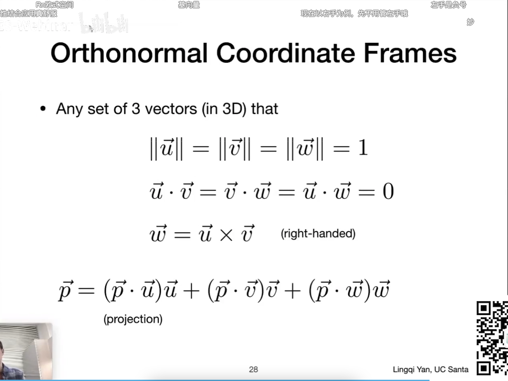

#### 矩阵（Matrix）

1.  **矩阵乘法** ：，只有矩阵 1 的列数和矩阵 2 的行数相同，矩阵乘法才有意义；
2.  **计算积矩阵中 i, j 位置的值：直接求矩阵 1 第 i 行和矩阵 2 第 j 列的点积** ；

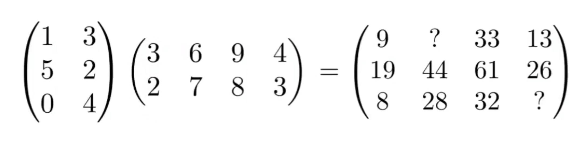

3.  **矩阵乘法** ：交换律不成立，结合律和分配律都是成立的，尤其结合律比较有用；
4.  **转置矩阵** ：如图，有一个性质，矩阵积的转置等于其各自转置后调换顺序的积，；

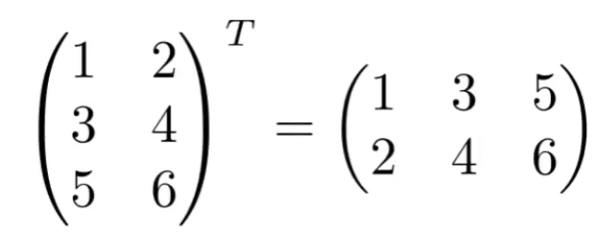

5.  **单位矩阵** ：，它乘任何矩阵都等于矩阵本身；
6.  **逆矩阵** ：结合单位矩阵，它有几个性质；
- ，矩阵乘自己的逆矩阵等于单位矩阵；
- ，与转置矩阵那个定理相同；
7.  **向量乘法转矩阵乘法** ：
- ；
- ，这个称为 dual matrix of A，暂时不清楚是怎么生成的；

### Lecture 03 Transformation

#### 2D 变换（2D Transforms）

1.  **缩放（Scale）** 

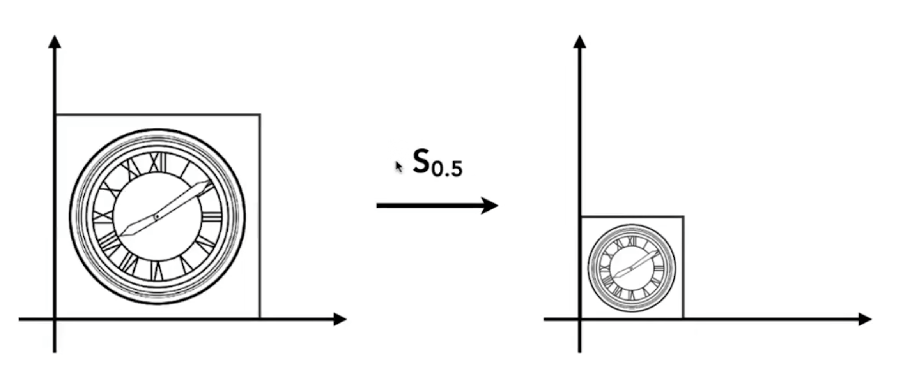

- 数学公式可以表达为：，，也就是 x、y 分别乘上缩放比例；
- 显然这个公式可以转换为矩阵形式：，转换出来跟上面的数学公式是相同的；
2.  **切变（Shear）** 

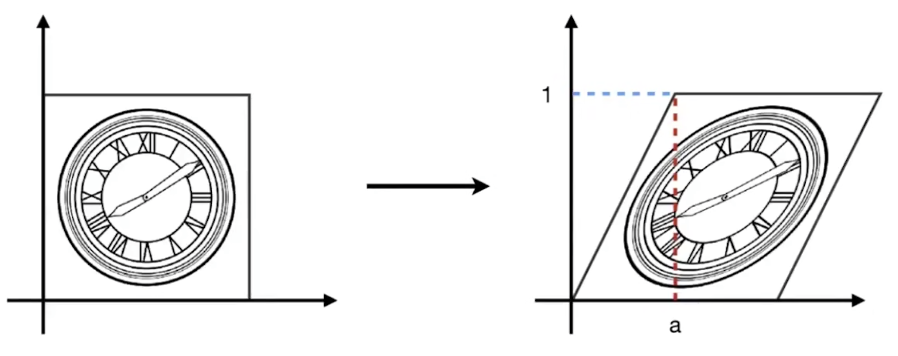

- 有点类似倾斜？webgl 那本书就没讲到这个，这里我们用图来推论它的公式；
- 显然，在变换前后，y 坐标是不变的；
- y = 0 时，x 坐标是没有发生变化的；
- y = 1 时，假设 x 坐标向右偏移了 a 距离，此时形状左端的 x 坐标为 a，右端的 x 坐标就是 a+1；
- 考虑到它是一个均匀的变化，当 y = 1/2 时，x 轴的偏移距离则为 a/2，形状左端的 x 坐标则为 a/2，右端的坐标则为 a/2+1；
- 此时我们推断数学公式：，；
- 转化为矩阵形式：；
3.  **旋转（Rotate）** 

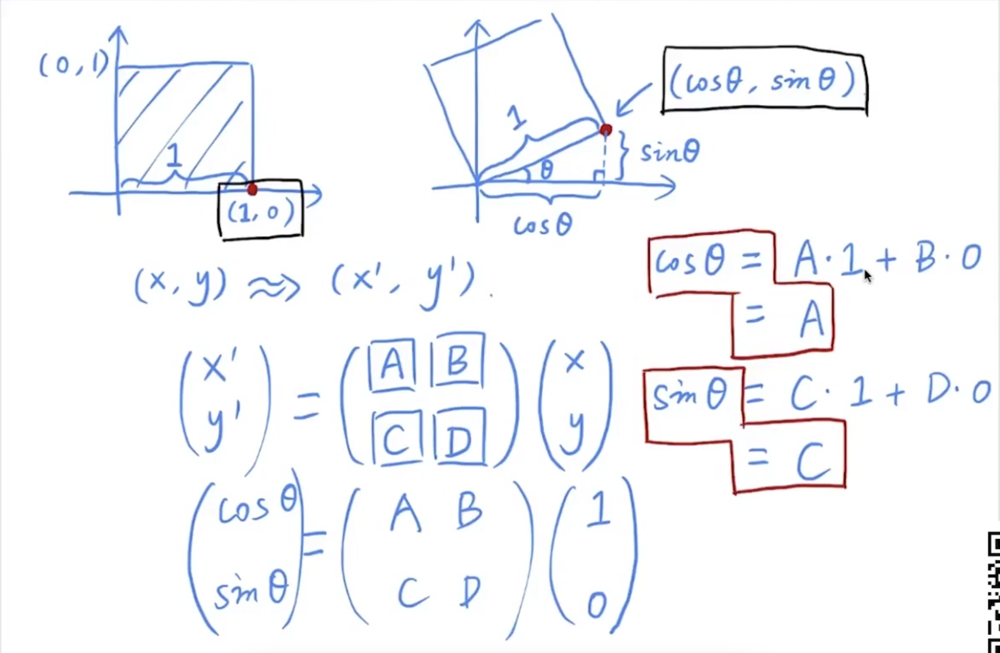

- 用一个特殊点来推断通用的公式，图示为点 (1, 0) 旋转 θ 角的情况，可得 cosθ 对应矩阵位置 A，sinθ 对应矩阵位置 C；同理 B 位置对应的是 -sinθ，D 位置对应的是 cosθ；
- 即：；
4.  **推导：线性变化都可以用矩阵来表示，但我们必须找到一个相同维度的矩阵，也就是将其表示在同一个矩阵中，如何？** 

#### 齐次坐标 **（Homogeneous coodinates）** 

1.  **平移（Translation）** 
- 是最特殊的一种变换，因为它不能写成上面那些单纯的矩阵相乘形式，他必须加上一个常数；
- 因为它要加上常数，不能用乘法表示，所以 **平移不属于线性变化** ；
- 人们不想把平移当成一种特殊用例，所以如何将它们都进行通用的表示呢？
- 数学公式：，；
- 矩阵形式：;
2.  **齐次坐标（Homogeneous coodinates）** 
- 根据平移的矩阵公式扩充为：，这就是用齐次坐标表示平移的方式；
- 探讨齐次坐标的意义；
- 第一，引入 w 分量来表示平移，其中需要区分向量和点的表示，向量表示为，点表示为，这是因为新引入的维度是用来表示平移的，而 **向量具有平移不变性** ，所以不需要考虑它的平移属性，置为 0 即可；
- 第二，w 分量还包含点、向量之间加减法的实际意义，比如：
- ，他们加出来 w 分量仍是 0，也表示向量，符合向量加法的原理；
- ，结果 w 分量是 1，表示一个点，含义是点朝某个方向移动，结果仍是一个点；
- ，结果分量是 0，表示一个向量，含义是两点之间的连线可以表示一个方向，也符合坐标减法的原理；
- ，比较特殊，因为这样加起来 w 分量会变成 2，后来人们给了它一个定义，就是将三个分量同时除以 w，得到，突然发现这不就是表示，两点相加，得到的就是线段中点？笑死；

####  **仿射变换（Affine Transformations）** 

1.  **仿射变换（Affine Transformations）** 
- 线性变化（旋转、切变、缩放）+平移，给他一个新名字叫做 **仿射变换** ；
- 用齐次坐标表示仿射变换：；
2.  **逆变换（Inverse Transform）** 
- 逆变换反应到数学上，就是乘上变换的逆矩阵；
- 复杂变换分解（Decomposing Complex Transforms），比如下图中的正方形，我想让他绕 c 点旋转，那就可以先将 c 点平移回原点，再将正方形旋转，然后乘上刚才平移的逆矩阵，就可以实现了；

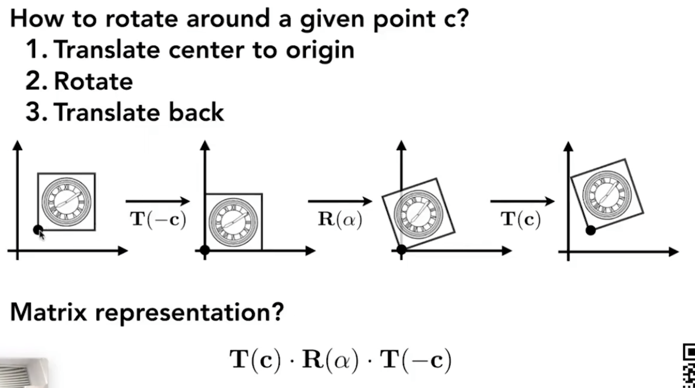

3.  **组合变换（Compose Transform）** 
- 表现为矩阵相乘，会发现，变换的顺序不同，变换的结果也不同，这一点对应了之前矩阵乘法不满足交换律的知识（用矩阵去代表图形变换很巧妙，变换和数学意义有很多是一一对应的）；
- 用矩阵乘法表示变换时，应用变换的方向是 **从右向左** 的；
- 变换可以组合多个；

#### 3D 变换（3D Transforms）

1. 齐次坐标
- 三维增加了一个维度，但各种变换与二维情况下并无区别，向量就可以表示为，点表示为；
- 矩阵表示变为;
- 平移和线性变换，哪个先进行？在 2D 变换中，我们在推导出需要使用 w 分量之前，数学式是下图，可以发现平移是加法，所以是先进行线性变换，再进行平移；

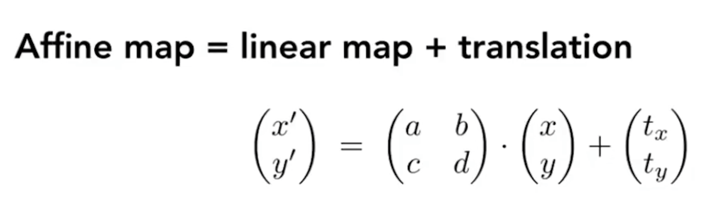

### Lecture 04 Transformation Cont.

#### 题外话

1.  **旋转矩阵逆变化的推导** 
- 旋转矩阵的公式是这样的：；
- 它的 **逆矩阵** 就是旋转 -θ 度，可以表示为：，这是因为把 -θ 代入后，由 cos(-θ)=cosθ、sin(-θ)=-sinθ 两个公式可以推导出；
- 而旋转矩阵的 **转置矩阵** ，也是这样表示：；
- 可以得出一个定理， **旋转矩阵的逆矩阵跟转置矩阵相同；** 
- 在数学上，逆矩阵等于转置矩阵的情况，有一个专门的名词表示： **正交矩阵** ；

#### 3D 变换（3D Transforms）

1. 书接上回
2.  **3D 缩放** ：很简单，加一个坐标；
3.  **3D 平移** ：很简单，加一个坐标；

#### 3D 旋转（3D Rotations）

1.  **先按照 2D 上的情况来拓展** 
- 绕 x 轴旋转时，x 轴坐标是不变的，那就将 x 轴所表示的行列忽视掉，设为单位矩阵的形式（1, 0, 0）；
- 绕 z 轴旋转同理，将 z 轴的行列去掉；
- 绕 y 轴这里，本质相同，也是将 y 轴行列去掉，但理解上有些不同；
- 如图所示，根据右手螺旋定则，绕 x 轴旋转是从 y 转到 z，它们叉乘之后正方向就是 x 轴所在方向；同理 z 轴也可以这样推出；但  **y 轴不同，从 z 轴转到 x 轴，叉乘结果是 y 轴的负方向** ，所以按这个理解，绕 y 轴旋转的变化矩阵就是，按上一节的推导，这里的变化矩阵应该是正常 **旋转的逆矩阵；** 

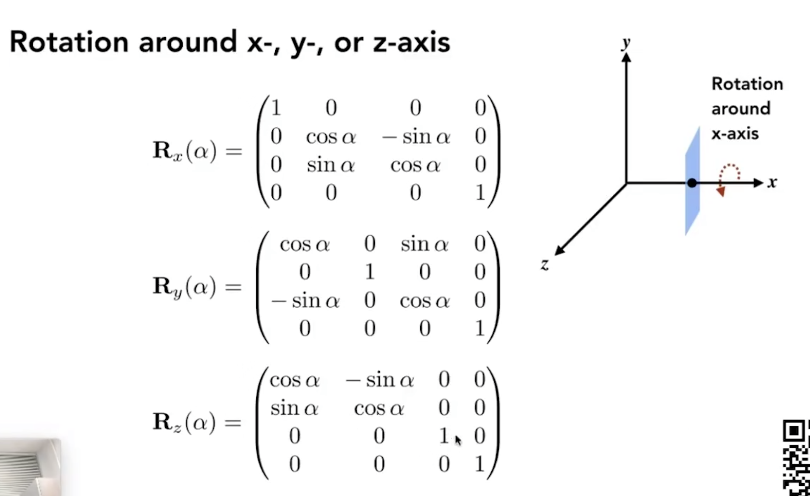

2.  **Rodrigues' Rotation Formula** 

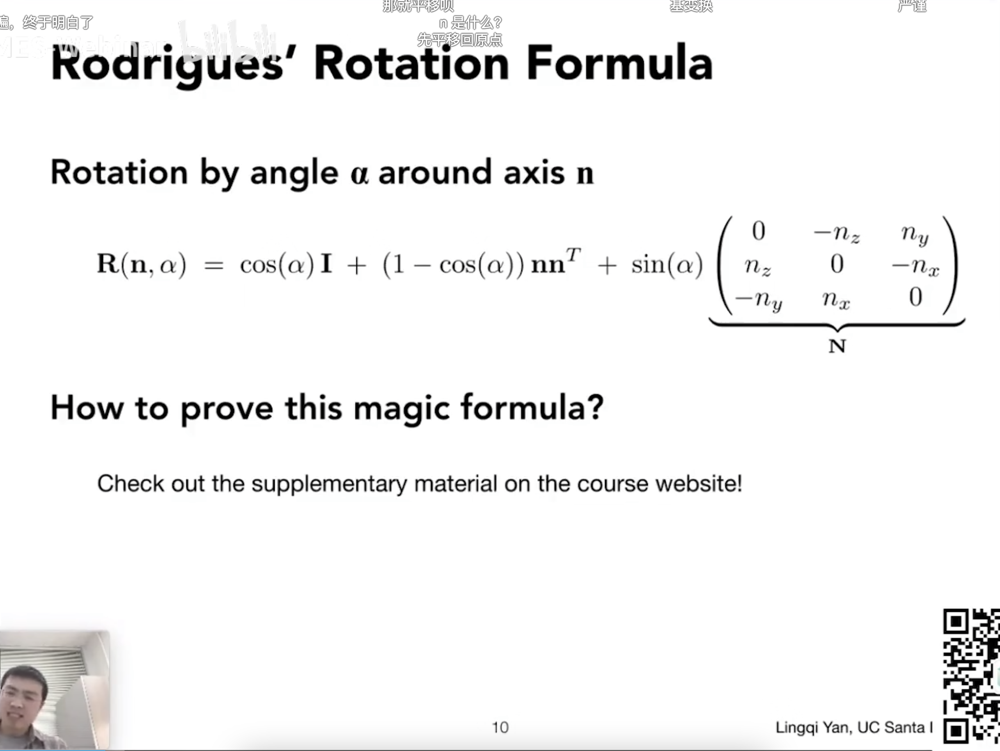

- ；
- 推导过程很复杂；
- 图中说的 n 轴是指可以只用一个向量表示；
- 如果非要以不过原点的轴旋转，则可以将轴平移到过原点的位置，操作完旋转后，再用平移的逆变换移回原位；

#### 视图/相机变换（View / Camera Transformation）

1. 包含 **模型变换（Model Transformation）、视图变换（View Transformation）、投影变换（Projection Transformation）；** 
2.  **定义相机位置：** 
-  **相机位置（Position）；** 
-  **观测方向（Look-at Direction）；** 
-  **上方向（Up Direction）；** 
3.  **相机与物体的相对关系：** 
- 相机与物体的位置是相对的，也就是说同样的变换，摄像机变换和物体变换都能做到相同的效果；
- 因此为了简化理解，则固定摄像机的位置，只变换物体的位置；
- 默认方向一般是 **将相机放在原点位置，以 Y 轴为上方向，-Z 轴为观测方向** ；
4.  **如果有任意的相机位置，如何将其移到默认位置？** 
- 将起始点 e 移到原点；
- 将观测方向 g 旋转到 -Z 轴；
- 将上方向 t 旋转到 Y 轴；
- g × t 的方向也会自动旋转到 X 轴上；

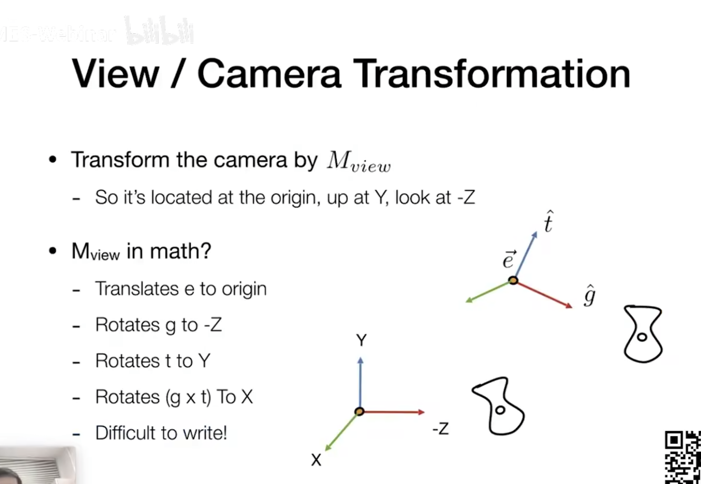

5.  **4 中的推演如何写成矩阵形式？** 
- 直接写 g 旋转到 -Z 这种不好写，转换思路，可以把三个变换的逆变换都写出来，比如 -Z 到某某某向量的旋转，这样比较好求；
- 本课之初知道了旋转矩阵是正交矩阵，逆矩阵=转置矩阵，所以可以在求完三个逆旋转之后，求其转置矩阵，再结合上最后的平移变换，就是最终的公式了；
- 先求旋转逆矩阵：；
- 求转置矩阵，得到正确的旋转矩阵：；
- 最终再结合上平移矩阵即可；

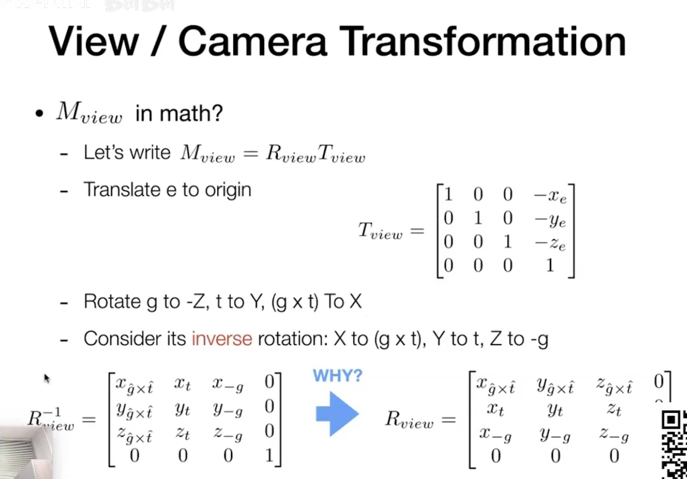

#### 投影变换（Projection Transformation）

1. 分为 **正交投影（Orthorgraphic Projection）与透视投影（Perspective Projection）** ；
- 正交投影不会带来近大远小的现象，透视投影才会；
- 正交投影通常用于工程制图领域；

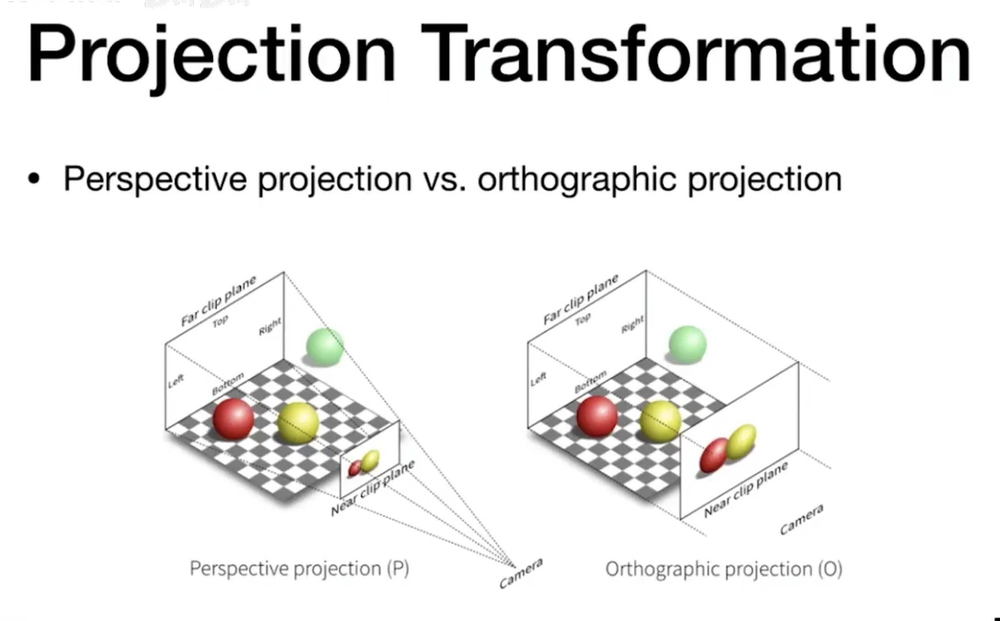

2.  **正交投影** 
- 将摄像机放在初始位置（原点、观测方向为 -Z、上方向为 Y）；
- 在正交投影下，这样就可以忽视掉 Z 轴的存在，因为 z 坐标怎么变投影结果都是一样的；
- 将 Z 轴扔到不便数学表达；

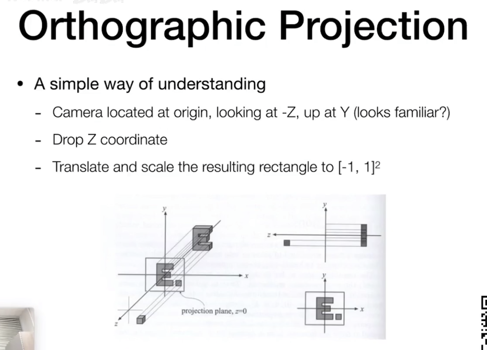

- 下面需要找一种容易描述的方式；
- 通常我们会将一个长方体映射到一个 **标准立方体（Canonical Cube）** 上；
- 先将中心点移到坐标系原点，然后再将各边拉伸到 [0, 1]、[0, -1] 等位置；
- 这里的 [l, r]、[b, t]、[f, n] 是指某一个面的中心点，分别对应左右、底顶、远近；

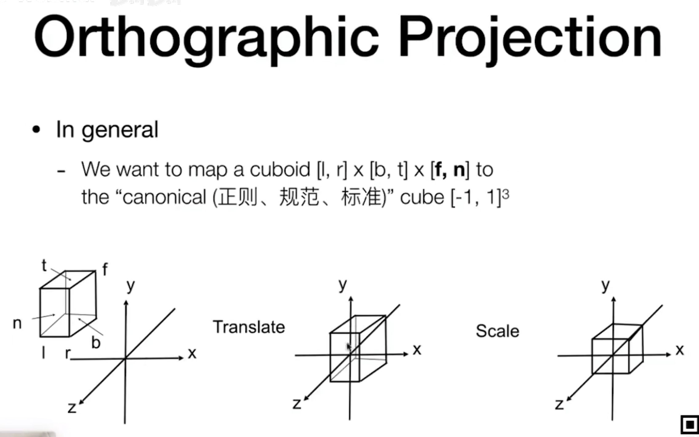

- 数学式包含缩放与平移，非常直观；

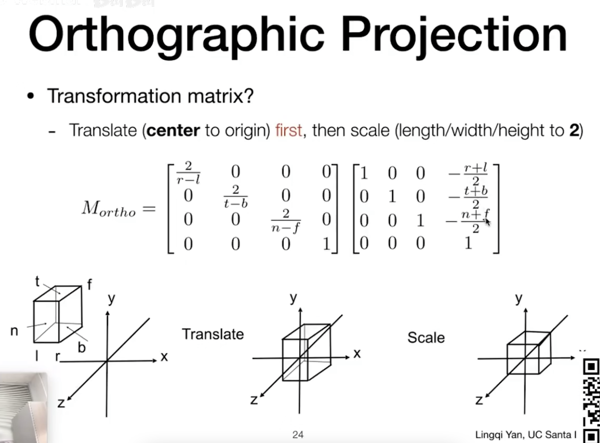

- 由于观测方向是 -Z，所以离摄像机近的 z 坐标反而大，所以 n >= f，有些不便理解；
- OpenGL 用左手系，就可以规避这个问题，但是左手系存在别的问题；
3.  **透视投影** 
- 特征：使用最广泛、近大远小、平行线不再平行；
- 复习：齐次坐标中，对所有分量乘同一个数，表示的都是同一个点；

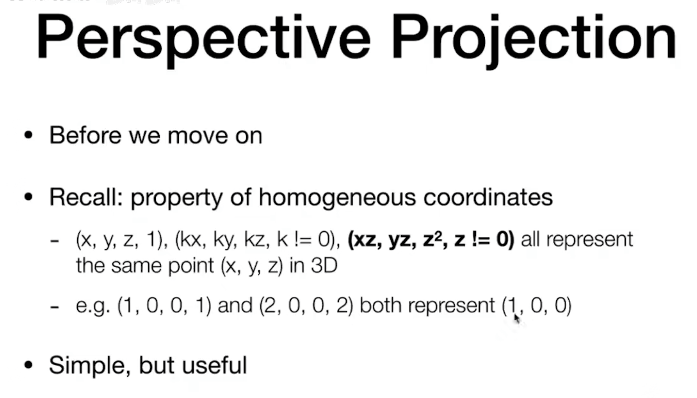

-  **如何实现：** 
- 1）与正交投影一样，定义远近两个平面，但透视投影中，远平面会更大一些；
- 2）将远平面挤压成跟近平面一样的大小；
- 3）再对两个平面做正交投影；
- 这样将透视投影拆分成了两个步骤，更好理解；

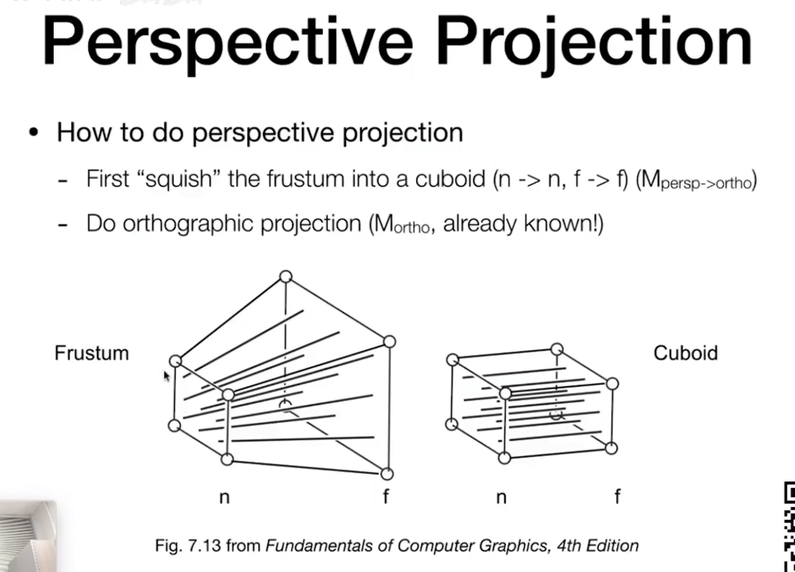

- 看下图，我们的目的是要将远平面压缩成近平面的大小，这样可以构造出一对相似三角形；
- 假设目标平面的 Z 坐标是 n，则两平面 Z 坐标之比为；
- 相似三角形各边之比相等，因此、；

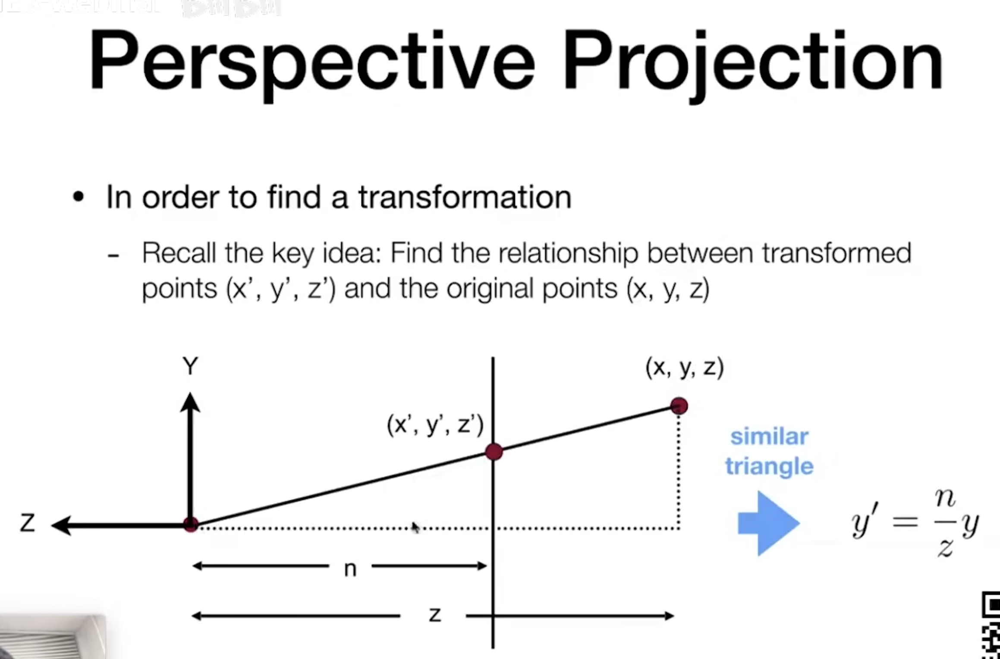

- 把 x, y, z 表示为齐次坐标中的一个点，按照上面的推断可得；
- 在齐次坐标中，四个分量同时乘同一个数，仍是同一个点，因此得到；
- 所以可以知道，如果要把远平面的点投影到近平面的点，就可以通过乘上矩阵实现；
- 这样就可以推断，等于；

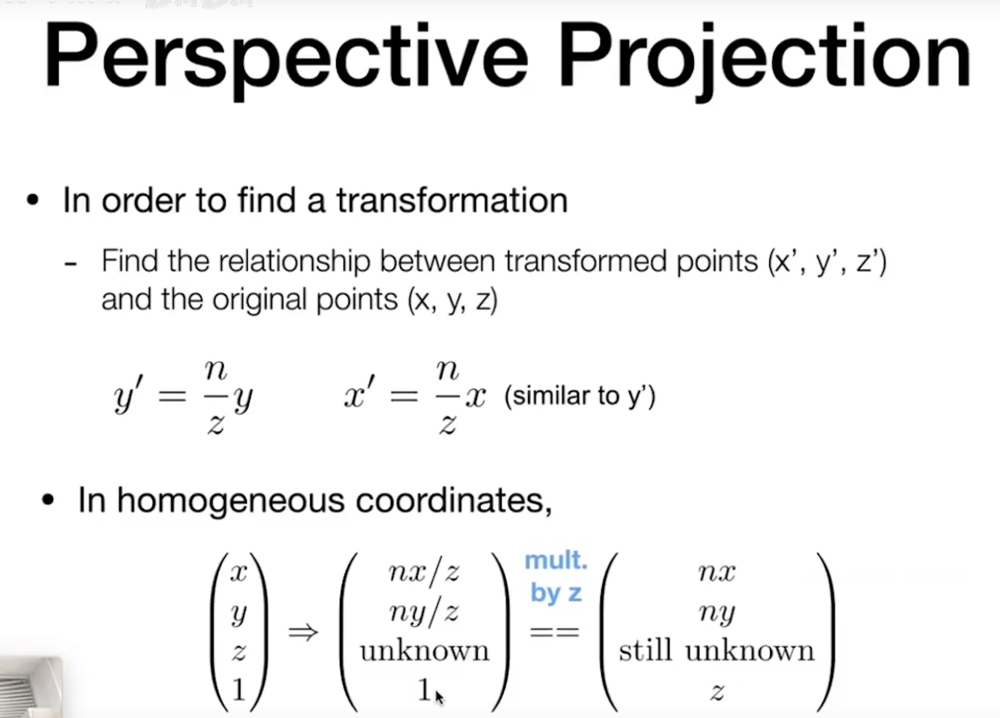

- 接下来是两个观察：
- 近平面上的点，挤压完仍是同一个点；
- 远平面上点的 z 坐标，挤压完仍是不变的；
-  **近平面：** 如果有一个近平面上的点，它就可以这样转化：；
- 将这个特殊的 case 代进之前的矩阵公式中：；
- 对照乘积中的，可得矩阵第三行会是 (0, 0, A, B)，之所以有 A、B 是因为无法确定如何组合出；
- 这里推出的公式可以简化为：；
-  **远平面：** 这次的特殊 case 是远平面的中心点，它挤压之后所有坐标都不会变；
- 可得推论：；
- 代入矩阵公式，顺便简化一下得：；
- 结合两个公式解得：、；
- 所以最终的矩阵就是：，这样就将透视投影的公式变成只关于近平面和远平面的 z 坐标了；
- 别急，只是做挤压的矩阵，挤压完还要做正交投影才是最终结果；
- 加上正交投影应该是这样：；
-  **作业：** 对于 z 在 n 和 f 中间的一个点，比如 (n+f)/2，它在挤压后是离远平面近还是近平面近？

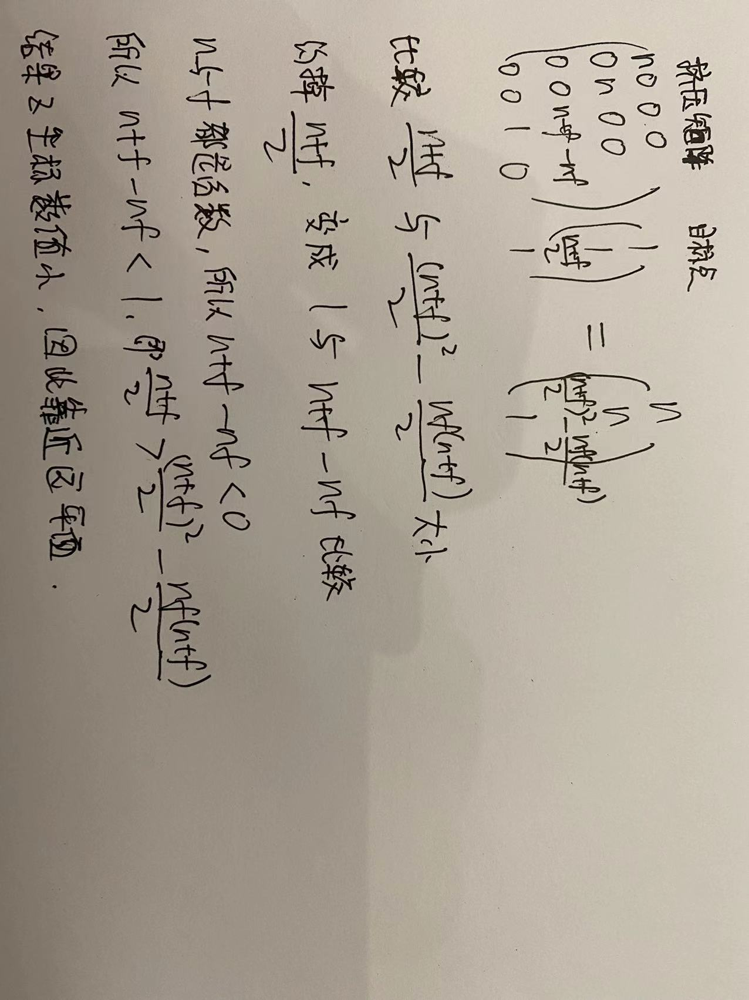

