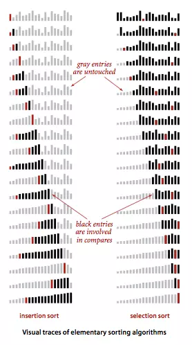
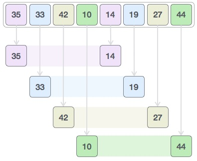
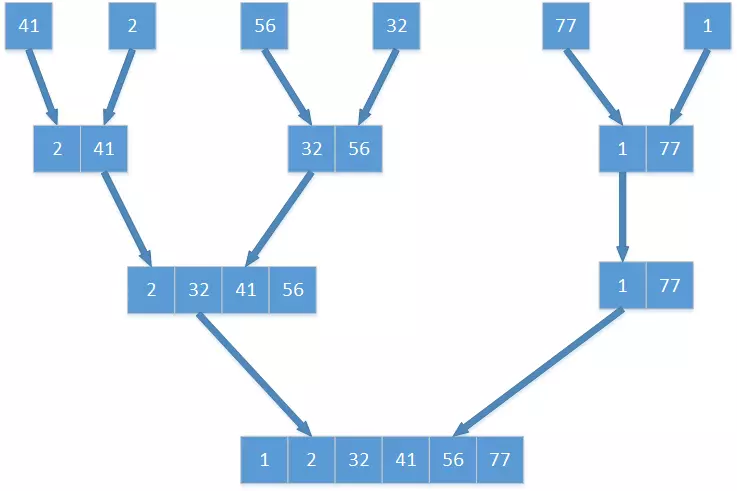
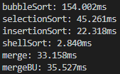
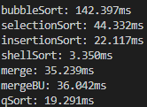
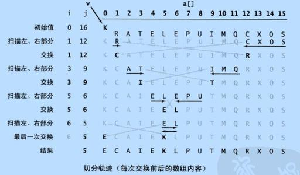
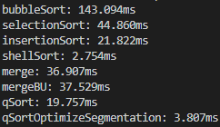
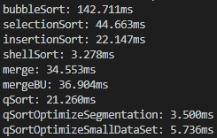
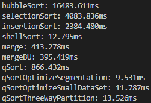
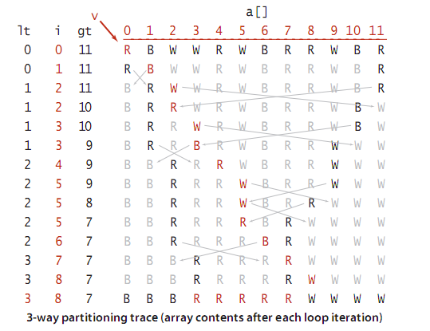

# 排序算法

### 前言

作为一个非计算机专业出身的渣渣小前端，算法是前端技能进阶路上一座绕不开的大山。曾经尝试到 leetcode 上开坑，然而发现做出一道题，要花上好几个小时的时间。后来搜了一些算法学习方法相关的文章，许多人都提到：算法需要先系统性的学习，再去做题。而我平时开发最常使用 JavaScript，因此选用《数据结构与算法 JavaScript 描述》一书作为入门书籍。

阅读这本书之后，我与 [《JS家的排序算法》](https://www.jianshu.com/p/1b4068ccd505) 作者有一个相同的感受：书里有很多小错误，不仅仅是在文字描述上，在代码中也有出现。但是不得不承认，这本书非常适合前端开发者的算法入门学习，原因是其内容足够简洁、基础，它简洁明了地解释了每种算法的原理，没有涉及优化，以及算法考察中的一些难点。所以，如果需要进阶学习，还是需要配合其他书籍食用。

这篇文章权当我学习算法过程中的笔记，就从算法中基础的类别：排序算法开始，有问题请大家指出，我会尽快修正，避免误导他人。

首先搭建一个简单的性能测试平台：

```javascript
// 使用一个函数集合保存所有用于测试的排序算法
let funcs = {
  // 工具：交换数组元素
  toolExch (a, lo, hi) { let temp = a[lo]; a[lo] = a[hi]; a[hi] = temp }
}
// 生成一个长度为 10000，数值为 0-99 之间的数组用于测试
// 注意：排序算法的性能往往与被排序数组的特性有关系
// 如重复数据的数量、数据大小的分布、数据整体的方差等
// 本文主要的方向还是说明各种排序算法的原理
// 因此直接生成一组随机数作为测试数据
let arr = Array.from({ length: 10000 }, v => Math.floor(Math.random() * 100))
// 执行集合中所有函数
for (let key in funcs) {
  // 遇到有 tool 标记的函数判断为工具函数，跳过
  if (!key.indexOf('tool')) { continue }
  let temp = Array.from(arr)
  // 使用 console 中的 time 和 timeEnd 函数输出代码执行时间
  console.time(key)
  funcs[key](temp)
  console.timeEnd(key)
}
```


#### 冒泡排序

冒泡排序是最慢的排序算法之一，因为它交换元素的次数实在是太多了，但它也是最容易实现的排序算法。在运行过程中，数据值会像气泡一样从一端漂浮到另一端，比如升序排序，数据会与其右侧相邻的数据进行比较，若它比右侧数据大，则会向右边“冒泡”，直到遇到比它大的数据为止。


#### 动图演示


> Bubble Sort 动图演示 算法可视化来源：[http://visualgo.net/](http://visualgo.net/)


#### 代码实现

```javascript
let funcs = {
  // 冒泡排序
  bubbleSort (arr) {
    // 使用一个两层的循环执行排序
    // 内层循环每执行一次，外层循环的指针 i 就向前进一步，表示前面的数据确认已经完成排序
    for (let i = 0; i < arr.length - 1; i++) {
      // 内层循环保证每次都能将最小的数据移到数组最左边
      for (let j = arr.length - 1; j > i; j--) {
        // 当前数据值比前一位的小，则将两个数据交换位置
        // 否则不进行操作，继续处理下一位的数据
        if (arr[j] < arr[j - 1]) {
          this.toolExch(arr, j - 1, j)
        }
      }
    }
    return arr
  }
}
```


### 选择排序

选择排序的原理，以升序排序为例，就是从数组的开头开始，用第一条数据和其他数据进行比较，取其中最小的数据，与第一个位置的数据交换，再用第二条数据对后面的数据进行比较......如此反复，当在数组的倒数第二位上执行完这个比较，整个排序就完成了。

与冒泡排序一样，选择排序也采用了两层循环，但选择排序在每次遍历中只进行了一次数据位置的交换，因此它的速度比冒泡排序要快的多。


#### 动图演示


> Selection Sort 动图演示 算法可视化来源：[http://visualgo.net/](http://visualgo.net/)


#### 代码实现

```javascript
let funcs = {
  // 选择排序
  selectionSort (arr) {
    // 外层循环维护一个指针 i，每当内层循环完成一次交换，外层循环的指针就往前移一步
    // 指针移动到倒数第二个位置 arr.length - 2 时，结束循环
    for (let i = 0; i <= arr.length - 2; i++) {
      // index 维护了当前内循环中最小值的位置
      let index = i
      // 内层循环从指针 i 的位置往后查找最小的数据
      for (let j = i; j < arr.length; j++) {
        // 每当找到更小的数据，就更新 index
        if (arr[j] < arr[index]) index = j
      }
      // 将位置在 index 的最小数据与位置在 i 的当前指针互换位置
      this.toolExch(arr, index, i)
    }
    return arr
  }
}
```


#### 性能比较


用上面的代码进行一次粗略的运行（10000 条数据），得出选择排序的性能要远远超过冒泡排序。


### 插入排序

插入排序同样使用两层循环，以升序排序为例：外层循环维护了一个指针 i，它从第二条数据开始向右移动。内层循环则维护一个指针 j 从 i 的位置开始向左移动，若 j 左边的数据比 j 大，则将左边的数据右移一格，直到遇到 j 左边的数据比 j 小，就停止移动，并把最开始用于比较的 i 上的数据插入到这一位置。如此反复，可以保证`每次内循环结束，i 左边的数据都是有序的`，则执行完外循环即可完成排序。


#### 动图演示


> Insertion Sort 动图演示 算法可视化来源：[http://visualgo.net/](http://visualgo.net/)


#### 代码实现

```javascript
let funcs = {
  // 插入排序
  insertionSort (arr) {
    // 向右移动的外循环
    for (let i = 1; i < arr.length; i++) {
      // 声明内循环指针
      let j = i
      // 记录用于比较的当前数据
      let curr = arr[i]
      // 内循环，让当前数据一直向左移动
      // 直到遇到比当前数据小的值，或移动到数组左端为止
      while (j > 0 && arr[j - 1] > curr) {
        // 将更大的数据往右推
        arr[j] = arr[j - 1]
        // 指针左移
        j--
      }
      // 将当前数据插入到正确位置，使得 0~i 之间的数据有序
      arr[j] = curr
    }
    return arr
  }
}
```


#### 性能比较



> 图片来自 algs4.cs.princeton.edu


根据《算法（第4版）》中比较插入排序与选择排序的可视轨迹图，发现插入排序加入比较的数据比选择排序要少许多。因此，插入排序的性能是要强于选择排序的。


用上面的代码进行一次粗略的运行（10000 条数据），发现插入排序比选择排序快许多。


### 希尔排序

《数据结构与算法 JavaScript 描述》一书中将希尔排序放在了高级算法的开篇位置，其实，希尔排序是在插入排序的基础上进行了改善，它定义了一个间隔序列，让算法`先比较大间隔的数据`，使离正确位置远的元素可以更快的归位，从而减少比较的次数，然后缩小间隔序列进行比较，直到间隔序列为 1 时，数组有序。

《算法（第4版）》的合著者 Robert Sedgewick 通过一个公式动态定义了希尔排序中的间隔序列，在我们的代码实现中，就采用这种方法定义间隔序列。原书中将这种方式称为“简洁的希尔排序”，事实上，希尔排序的性能与间隔序列的定义有着密切的联系。



> 对间隔为 4 的数据进行比较示意图


#### 动图演示


> 希尔排序动图演示


#### 代码实现

```javascript
let funcs = {
  // 希尔排序
  shellSort (arr) {
    // 定义间隔序列 gap
    let len = arr.length
    let gap = 1
    while (gap < len / 3) {
      gap = gap * 3 + 1
    }
    // 按照间隔序列中的间隔逐次进行插入排序
    while (gap >= 1) {
      // 执行插入排序
      for (let i = gap; i < len; i++) {
        let j = i
        let curr = arr[i]
        while (j >= gap && arr[j - gap] > curr) {
          arr[j] = arr[j - gap]
          // 每次前进的步数为 gap，形成对间隔的使用
          j -= gap
        }
        arr[j] = curr
      }
      // 生成下一个间隔
      gap = (gap - 1) / 3
    }
    return arr
  }
}
```


#### 性能比较

希尔排序的效率与`间隔序列的选择`有很大的关系，《算法（第4版）》中描述道：“算法的性能不仅取决于 h（即间隔），还取决于 h 之间的数学性质，比如他们的公因子等。有很多论文研究了各种不同的递增序列，但都无法证明某个序列是‘最好的’”。


用上面的代码对 10000 条数据运行，发现在这个体量下希尔排序比插入排序快非常多。


### 归并排序

归并排序是应用高效算法设计中`分治思想`的典型栗子，它的基本原理就是将数组不断的对半拆分，直到拆分为一对单个元素，然后将一对单个元素排列至有序，再与相邻的一对有序元素合并为一个大的有序数组，直到整个数组有序。

在代码上，它有两种实现方式，分别是使用递归的，`自顶向下的归并排序`（请见动图演示：自顶向下的归并排序），以及使用循环的，`自底向上的归并排序`（请见图片演示：自底向上的归并排序）。它们各有各的优点，递归方式比较容易实现，但是会占用额外的内存空间；循环方式逻辑比较复杂，但是占用内存较少，性能较好。

[《JS家的排序算法》](https://www.jianshu.com/p/1b4068ccd505) 一文中指出：

> 好消息！好消息！ES6已经添加了对尾递归优化的支持，妈妈再也不用担心我用JavaScript写递归了。不过，需要注意的是，ES6的尾递归优化只在严格模式下才会开启。


事实上，在浏览器端，除了 Safari，各大浏览器都并没有实现尾递归优化的特性。在 node 中，尾递归优化也并不是默认开启的，需要在调用时使用`--harmony_tailcalls`参数，才能手动开启。而且 JS 的尾递归优化仍存在隐式优化和调用栈丢失的问题。因此，在 JS 引擎下使用递归方式的归并排序，仍然有性能和稳定性方面的担忧。详情参考 [《尾递归的后续探究》](https://imweb.io/topic/5a244260a192c3b460fce275)。


#### 动图演示


> 动图演示：自顶向下的归并排序 算法可视化来源：[http://visualgo.net/](http://visualgo.net/)




> 图片演示：自底向上的归并排序


#### 代码实现

```javascript
let funcs = {
  // 自顶向下的归并排序
  merge (arr) {
    // 递归的排序方法，接收数组、要排序的起始位置与结束位置
    let sort = (a, lo, hi) => {
      // 若 hi <= lo，则数组已经无法再分半，即为递归终点，则开始进行排序
      if (hi <= lo) return
      // 计算要排序数组的中间位置
      // mid 即为前半部分排序的终点
      // mid + 1 为后半部分排序的起点
      let mid = lo + Math.floor((hi - lo) / 2)
      // 分别对前后两半进行递归调用，直到无法再分半为止
      sort(a, lo, mid)
      sort(a, mid + 1, hi)
      // 对数组前后两半执行归并
      this.toolMerge(a, lo, mid, hi)
    }
    sort(arr, 0, arr.length - 1)
    return arr
  },
  // 自底向上的归并排序
  mergeBU (arr) {
    // 获取数组长度
    let len = arr.length
    // 外层循环维护一个归并的单位大小 sz
    // 因为总是进行对半拆分，所以它每次进行归并的数组应该扩大为 2 倍，即每次递增操作为 sz *= 2
    for (let sz = 1; sz < len; sz *= 2) {
      // 内循环维护了每次归并的数组的起始位置 lo
      // 结束条件的解释是：lo + sz 指进行归并数组的前一半长度，若 lo + sz 的右边已经没有数据可供归并，则循环可以结束
      // 内循环每次执行归并的数组大小为 sz * 2，因此每次递增增加 sz * 2
      for (let lo = 0; lo < len - sz; lo += sz * 2) {
        // 对当前操作的数组执行归并
        // 起始点为 lo，中间位置为 lo + sz - 1
        // 结束位置若数组末端的下标更小，则需取数组末端的位置，以结束整个数组的归并
        this.toolMerge(arr, lo, lo + sz - 1, Math.min(lo + sz * 2 - 1, len - 1))
      }
    }
    return arr
  },
  // 工具函数：原地归并
  // 它接收一个两半各自有序的数组、起始位置、中间位置、结束位置四个参数
  // 输出将数组左右两半归并（边合并边排序），得出的大的有序数组
  toolMerge (a, lo, mid, hi) {
    // 声明指针 i、j，用于表示分别遍历左右两半数组的下标
    let i = lo // 左数组的开头
    let j = mid + 1 // 右数组的开头
    // 声明一个临时数组，并将传入数组的所有元素复制过去
    // 再从临时数组中取出元素回归到原数组中，最终输出原数组
    let temp = []
    for (let k = lo; k <= hi; k++) temp[k] = a[k]
    // 遍历临时数组
    for (let k = lo; k <= hi; k++) {
      // 若左数组已经取完，则必从右数组取值，并将右数组指针右移一步
      if (i > mid) { a[k] = temp[j++] }
      // 若右数组已经取完，则必从左数组取值，并将左数组指针右移一步
      else if (j > hi) { a[k] = temp[i++] }
      // 若此时右数组的值更小，则取右数组的值回归原数组，并将右数组指针右移一步
      else if (temp[i] >= temp[j]) { a[k] = temp[j++] }
      // 若此时左数组的值更小，则取左数组的值回归原数组，并将左数组指针右移一步
      else if (temp[i] < temp[j]) { a[k] = temp[i++] }
    }
  }
}
```


#### 性能比较



用上面的代码对 10000 条数据运行，发现这里的归并排序比希尔排序还要慢一些，但还是比选择排序和插入排序等基础排序快。

《算法（第4版）》中描述道：“在实际应用中，归并排序与希尔排序的运行时间差距在常数级别之内，因此相对`性能取决于具体的实现`。理论上来说，还没有人能证明希尔排序对于随机数据的运行时间是线性对数级别的，因此存在平均情况下希尔排序的运行时间更高的可能性。在最坏情况下，这种差距的存在已经被证实，但这对实际应用没有影响。”

事实上，归并排序还能通过对小规模数组执行插入排序、当左数组的最右小于右数组的最左时直接认定整个数组有序等方式优化其性能。所以，上面的代码是有很大的优化空间的，也并不能说明归并排序比希尔排序慢。


### 快速排序

许多书籍都给予了快速排序很高的评价。快速排序是一种平均性能十分优秀的算法，且只需要一个很小的辅助栈（占用内存小），原理也十分简单。

快速排序同样是基于分治的设计思想，它需要一个`切分点 pivot`，以升序排序为例，将数组剩余的元素中大于 pivot 的放到它的右边，小于 pivot 的放到它的左边，然后对根据 pivot 切分的左数组和右数组再分别进行同样的排序，然后递归进行切分操作，直到整个数组有序。


#### 动图演示


> Quick Sort 动图演示 算法可视化来源：[http://visualgo.net/](http://visualgo.net/)


#### 代码实现

```javascript
let funcs = {
  // 使用辅助数组进行拆分，实现非常简单
  qSort (arr) {
    if (arr.length === 0) { return [] }
    // 声明辅助数组，保存比 pivot 小及比 pivot 大的数据
    // 声明 pivot，这里为了方便直接取数组的第一个值
    // 事实上，pivot 可以为被排序数组中任意的值，且如何对它进行取值会影响算法最终的性能
    let lesser = [], greater = [], pivot = arr[0]
    // 遍历数组，将小于 pivot 的数据放入 lesser中
    // 大于 pivot 的数据放入 greater 中
    for (let i = 1; i < arr.length; i++) {
      if (arr[i] < pivot) {
        lesser.push(arr[i])
      } else {
        greater.push(arr[i])
      }
    }
    // 最终输出 [...小于 pivot 的数据集合, pivot, ...大于 pivot 的数据集合]
    // 并对被切分后的左右数组分别进行递归调用，以输出有序的左右数组
    // 因此在所有递归完成后，整个数组就会有序
    return this.qSort(lesser).concat(pivot, this.qSort(greater))
  }
}
```


#### 性能比较

上面的代码大量运用了 JS 的原生 API，性能必然不会出彩，下面我们来看看它的性能表现。



用上面的代码对 10000 条数据运行，结果快速排序的性能只比上述未经性能优化的归并排序好一些，与身为基础排序的插入排序性能几乎持平，远远逊色于之前实现的希尔排序。


将数据量扩大到 100000 条，发现这里实现的快速排序的性能更差，运行时间是上面归并排序的两倍。但是很有意思的是，当数据量增大，基础排序算法的性能出现急剧下降，基于分治思想的归并排序与快速排序则展现出了优势。

《算法（第4版）》中对于快速排序的优缺点进行了明确的解释：“快速排序的内循环比大多数排序算法都要短小，这意味着它无论是在理论上还是在实际中都要更快。它的主要缺点是非常脆弱，在实现时要非常小心才能避免低劣的性能。”因此快速排序需要各种算法优化的手段，避免这些情况的发生。


### 快速排序的优化


#### 使用交换前后数组元素的方式切分，减少操作的次数

根据上一节实现的经验，我们应该避免在切分的过程中使用 JS 的原生 API，因此我们需要`优化切分`的过程，这里采用交换前后数组的方式进行切分。


##### 图片演示




##### 代码实现

```javascript
let funcs = {
  // 使用交换前后数组元素的方式切分
  qSortOptimizeSegmentation (arr) {
    // 接收数组 a、数组起始位置 lo、结束位置 hi
    // 将数组切分为左边小于切分点，右边大于切分点的两部分
    // 最终输出切分点的位置
    let partition = (a, lo, hi) => {
      // 声明指针 i、j，分别从前向后以及从后向前遍历数组；声明切分点 v
      let i = lo, j = hi + 1, v = a[lo]
      // 外循环控制 i、j 两枚指针的运动情况，当他们相遇则结束循环
      while (true) {
        // 内循环遍历输入的数组，i 从前往后移动，j 从后往前移动
        // 只要获取到大于等于 v 的值，i 循环结束，获取需要移动到切分点右侧的数据位置 i
        // j 循环同理
        while (a[++i] < v) { if (i === hi) { break } }
        while (a[--j] > v) { if (j === lo) { break } }
        // 外循环终止条件，两枚指针相遇，整个数组遍历完成
        if (i >= j) { break }
        // 将需要移动到另一侧的两个数据交换位置
        this.toolExch(a, i, j)
      }
      // 此时数据已经以 j 与 j + 1 之间为分界，切分为了比 v 小的左数组与比 a 大的右数组
      // 将切分点与 j 数据交换位置，得出切分后的数据
      this.toolExch(a, lo, j)
      // 输出切分点位置 j
      return j
    }
    let qs = (a, lo, hi) => {
      // 处理到数组末尾，结束递归
      if (lo >= hi) { return }
      // 将数组切分为左边小于切分点，右边大于切分点的两部分，并输出切分点位置 j
      let j = partition(a, lo, hi)
      // 对左数组与右数组递归执行排序
      qs(a, lo, j - 1)
      qs(a, j + 1, hi)
    }
    qs(arr, 0, arr.length - 1)
    return arr
  }
}
```


##### 性能比较



10000 条数据的测试，可以发现将切分方式优化之后，速度明显加快。


将测试数据增加到 100000 条，发现优化切分方式后的快速排序性能已经超越了之前的所有实现。也可以发现，对于越大的数据集，越能发挥快速排序的性能优势。


#### 对小数据集进行插入排序，优化小数据集的排序速度

《算法（第4版）》中说明了在小数据集中使用插入排序的原因：

和大多数递归排序算法一样，改进快速排序性能的一个简单办法基于以下两点：

- 对于小数组，快速排序比插入排序慢
- 因为递归，快速排序的 sort() 方法在小数组中也会调用自己

因此，在排序`小数组时应该切换到插入排序`。然而，多小的数组才需要切换到插入排序呢？书中解释道：转换参数的最佳值是和系统相关的，但是 5~15 之间的任意值在大多数情况下都能令人满意。


##### 代码实现

```javascript
let funcs = {
  // 对大小小于 10 (5-15均可) 的数据集进行插入排序，优化小数据集的排序速度
  qSortOptimizeSmallDataSet (arr) {
    let partition = (a, lo, hi) => {
      let i = lo, j = hi + 1, v = a[lo]
      while (true) {
        while (a[++i] < v) { if (i === hi) { break } }
        while (a[--j] > v) { if (j === lo) { break } }
        if (i >= j) { break }
        this.toolExch(a, i, j)
      }
      this.toolExch(a, lo, j)
      return j
    }
    let qs = (a, lo, hi) => {
      // 起止位置的距离小于等于 10 时采用插入排序并结束递归
      if (hi <= lo + 10) { a = this.toolInsertionSort(a, lo, hi); return }
      let j = partition(a, lo, hi)
      qs(a, lo, j - 1)
      qs(a, j + 1, hi)
    }
    qs(arr, 0, arr.length - 1)
    return arr
  },
  // 在指定范围内执行插入排序
  // 在插入排序章节中的实现基础上增加起止位置的参数
  toolInsertionSort (arr, lo, hi) {
    for (let i = lo; i < hi + 1; i++) {
      let j = i
      let curr = arr[i]
      while (j > lo && arr[j - 1] > curr) {
        arr[j] = arr[j - 1]
        j--
      }
      arr[j] = curr
    }
    return arr
  }
}
```


##### 性能比较



> qSortOptimizeSmallDataSet 处理 10000 条数据



> qSortOptimizeSmallDataSet 处理 100000 条数据


> qSortOptimizeSmallDataSet 处理 1000000 条数据


> qSortOptimizeSmallDataSet 处理 10000000 条数据


超过一百万条数据之后，优化了小数据集处理的 qSortOptimizeSmallDataSet 函数取得了更好的成绩。


#### 使用三向切分优化它在应对大量重复数据时的效率

三向切分的关注点在于应对大量的`重复数据`。标准的快速排序仍然是基于比较的，这意味着无论重复元素有多少，它都会对所有元素进行比较来输出结果。而三向切分的原理则是将重复的元素聚合到数组中间，小元素分布到重复元素序列的左边，而大元素则分布在右边。


##### 图片演示


> 三向切分的轨迹（每次迭代循环之后的数组内容）


##### 代码实现

```javascript
let funcs = {
  // 三向切分把等于切分点的数据都移到中间，避免了所有等于切分点的数据重复排序
  qSortThreeWayPartition (arr) {
    // 接收一个数组、起始位置与结束位置
    let qs = (a, lo, hi) => {
      // 同样对小于等于 10 的数据集进行插入排序
      if (hi <= lo + 10) { a = this.toolInsertionSort(a, lo, hi); return }
      // 维护两个指针 lt、gt
      // [0, lt] 范围保存比切分值小的数据
      // [gt, arr.length - 1] 范围保存比切分数据大的数据
      // [lt, gt] 范围则是当次迭代中重复的切分值
      let lt = lo, gt = hi
      // 维护一个从左到右移动的指针 i，用于遍历数组
      let i = lo + 1
      // 标记当前的切分值 v
      let v = a[lo]
      // 从左向右遍历数组，直到移动到 gt 位置结束
      // 原因是
      while (i <= gt) {
        // 若当前值小于切分值，则将当前值与 lt 位置的切分值换位
        // lt++，即 lt 右移，为左侧空间的“新人”让一个位置
        // i++，遍历指针右移
        if (a[i] < v) { this.toolExch(a, lt++, i++) }
        // 若当前值大于切分值，则将当前值与 gt 位置的未知值换位
        // gt--，即 gt 左移，为右侧空间的“新人”让一个位置
        // i 指针此时不需要前进，因为从 gt 换过来的值未知，需要对这个位置重新进行判断
        else if (a[i] > v) { this.toolExch(a, i, gt--) }
        // 若当前值等于切分值，则不做处理，让它呆在 [lt, gt] 范围
        // 这个位置处理完毕，i 指针前进
        else { i++ }
      }
      // 对不等于切分值的数据递归执行排序
      qs(a, lo, lt - 1)
      qs(a, gt + 1, hi)
    }
    qs(arr, 0, arr.length - 1)
    return arr
  }
}
```


##### 性能比较


> 三向切分快速排序性能比较（十万条数据）


> 三向切分快速排序性能比较（一百万条数据）


> 三向切分快速排序性能比较（一千万条数据）


可以看出，数据量越大，三向切分的优势就越明显，这是因为重复的数据变多了。由于数据是在 0~100 范围内随机生成的，那么如果扩大或缩小数据生成的范围从而`减少或增加重复值的数量`，基于归类重复值的三向切分性能是否会受到影响呢？


> 三向切分快速排序性能比较（一千万条数据、在 0~10 范围内生成数据）


> 三向切分快速排序性能比较（一千万条数据、在 0~100 范围内生成数据）


> 三向切分快速排序性能比较（一千万条数据、在 0~1000 范围内生成数据）


> 三向切分快速排序性能比较（一千万条数据、在 0~10000 范围内生成数据）


我们发现，当生成范围缩小到 0~10 时，三向切分的优势被进一步扩大，但当生成范围扩大时，三向切分的优势迅速缩小，当生成数据在 0~10000 范围内时，三向切分的性能就已经低于二切分的实现了。因此三向切分的方案还是适用于重复数据比较多的时候，如对性别进行排序等等。


### 小结

事实上，仅在《算法（第4版）》一书的内容中，快速排序的优化思路就还有：切换到插入排序的时机选择、切分点的取样方式选择（如使用数组中位数）、二切分中使用哨兵代替边界检查、取样切分等等。时间所限，如此多的优化方案实在无法一一研究，更何况还有堆排序、计数排序、桶排序与基数排序这一系列排序算法，如果有机会我再一一补充上来。

不得不说，学习算法的过程总能让人体会到计算机程序的神奇（旁白：居然还能这样运行！），这大概就是“算法之美”吧~

> 最后附上文中测试平台的完整版地址：[https://github.com/yyj08070631/yyj/blob/master/算法/排序算法-测试工具.js](https://github.com/yyj08070631/yyj/blob/master/%E7%AE%97%E6%B3%95/%E6%8E%92%E5%BA%8F%E7%AE%97%E6%B3%95-%E6%B5%8B%E8%AF%95%E5%B7%A5%E5%85%B7.js)


### 参考来源

- [《JS家的排序算法》](https://www.jianshu.com/p/1b4068ccd505)
- 《数据结构与算法 JavaScript 描述》
- 《算法（第4版）》
